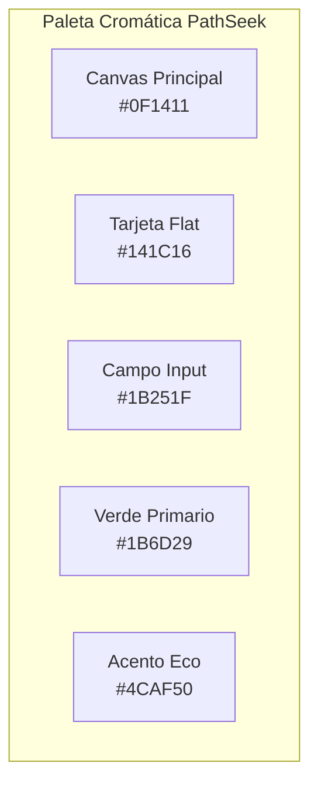
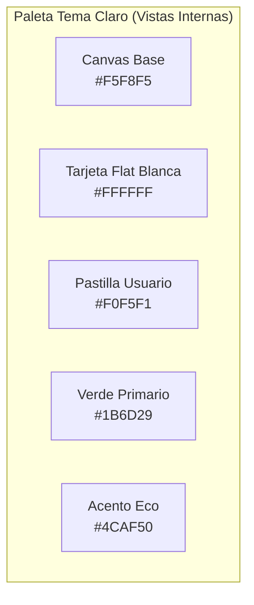

# Guía de Diseño y Sistema de Diseño UI/UX: PathSeek

**Documento:** DESIGN.md  
**Proyecto:** PathSeek – Optimizador de Rutas Sostenibles (UGEL Huancayo)  
**Enfoque de Diseño:** *Mobile-First, Flat Minimalist & Light Editorial Typography*  
**Versión:** V_1_0_0  
**Fecha:** 2026-10-06  

---

## 1. Filosofía y Principios de Diseño

El sistema de diseño de **PathSeek** adopta una estética **Minimalista, Flat y Ecológica**, orientada a maximizar la claridad operativa en dispositivos móviles de conductores y operadores logísticos de la UGEL Huancayo:

1. **Tipografía Ligera (Light Typography):**
   - Se prioriza el uso de pesos ligeros (`FontWeight.w300` *Light* y `FontWeight.w400` *Regular*), descartando tipografías ultra pesadas o negritas invasivas (`w900`).
   - Uso de espaciado entre letras (*letter-spacing*) calibrado (`0.2px` a `1.2px`) para otorgar una presencia moderna, técnica y sofisticada.
2. **Estética Flat Pura (Zero Heavy Shadows & Zero Skeuomorphism):**
   - Eliminación total de sombras proyectadas complejas (`elevation: 0`) y degradados saturados estridentes.
   - Jerarquía visual construida mediante contraste tonal, fondos planos mate y bordes de contorno finos de `1.0px` con opacidades controladas.
3. **Ergonomía Táctil Mobile-First:**
   - Dimensiones de interacción adaptadas a la zona de alcance del pulgar (*thumb zone*).
   - Objetos táctiles con altura mínima de `48dp` (cumpliendo directrices de accesibilidad de Google/Apple).
   - Chips de acceso rápido (*Quick-Fill Role Chips*) para agilizar la autenticación en pruebas de campo.

---

## 2. Paleta Cromática y Design Tokens

La paleta cromática combina tonos oscuros neutros con acentos verdes institucionales que transmiten sostenibilidad y eficiencia ambiental:

### 2.1 Tokens de Color

| Token | Código Hex / RGBA | Uso en la Interfaz | Ratio de Contraste |
| --- | :---: | --- | :---: |
| `--bg-canvas` | `#0F1411` | Fondo general de la aplicación | Base |
| `--bg-card` | `#141C16` | Fondo plano de tarjetas y contenedores | Neutro |
| `--bg-input` | `#1B251F` | Fondo plano de cajas de texto | Neutro |
| `--border-subtle` | `rgba(255, 255, 255, 0.08)` | Bordes y divisores en reposo | Sutil |
| `--border-input` | `rgba(255, 255, 255, 0.10)` | Borde de campos de formulario | 1.0px |
| `--primary-forest` | `#1B6D29` | Botón de acción principal (CTA flat) | $\ge 4.5:1$ vs Blanco |
| `--primary-dark` | `#0D4715` | AppBars y cabeceras institucionales | $\ge 7:1$ vs Blanco |
| `--accent-eco` | `#4CAF50` | Acentos, estados de foco e indicadores activos | $\ge 4.5:1$ vs Fondo |
| `--text-primary` | `#FFFFFF` | Títulos y valores principales | $14.2:1$ |
| `--text-secondary` | `#8E9E93` | Subtítulos institucionales y etiquetas | $5.1:1$ (WCAG AA) |
| `--text-muted` | `#7E8F83` | Textos explicativos e iconos inactivos | $4.5:1$ (WCAG AA) |
| `--text-placeholder` | `rgba(255, 255, 255, 0.25)` | Placeholder / Hint de inputs | Guía |
| `--state-error` | `#BA1A1A` | Bordes de validación y errores | $\ge 4.5:1$ |



---

## 3. Sistema Tipográfico

La escala tipográfica está balanceada para evitar la fatiga visual, utilizando fuentes limpias de trazo fino:

| Nivel Tipográfico | Tamaño (sp/pt) | Peso (`FontWeight`) | Letter Spacing | Color Sugerido |
| --- | :---: | :---: | :---: | :---: |
| **Brand Title (Prefix)** | `26sp` | `w300` (Light) | `0.8px` | `#FFFFFF` |
| **Brand Title (Suffix)** | `26sp` | `w400` (Regular) | `0.8px` | `#4CAF50` |
| **Form Heading** | `19sp` | `w400` (Regular) | `0.2px` | `#FFFFFF` |
| **Form Subtitle** | `12.5sp` | `w300` (Light) | `0.0px` | `#7E8F83` |
| **Field Label** | `12sp` | `w400` (Regular) | `0.3px` | `#B0C0B5` |
| **Input Text** | `14sp` | `w300` (Light) | `0.0px` | `#FFFFFF` |
| **Input Placeholder** | `13sp` | `w300` (Light) | `0.0px` | `rgba(255,255,255,0.25)` |
| **Button Text** | `14.5sp` | `w400` (Regular) | `0.4px` | `#FFFFFF` |
| **Tag Chip / Badge** | `11sp` | `w400` (Regular) | `1.2px` | `#9EAEA3` |
| **Role Chip Text** | `11.5sp` | `w300` (Light) | `0.2px` | `#A5B5AA` |
| **Footer Microcopy** | `11sp` | `w300` (Light) | `0.4px` | `rgba(255,255,255,0.25)` |

---

## 4. Arquitectura y Anatomía del Login Móvil

```text
┌─────────────────────────────────────────────────────────┐
│                       [SafeArea]                        │
│                                                         │
│                      ┌───────────┐                      │
│                      │  [Icono]  │ (52x52 Flat Container│
│                      └───────────┘                      │
│                    PathSeek (Light)                     │
│          UGEL Huancayo • Logística Sostenible           │
│                                                         │
│    ┌───────────────────────────────────────────────┐    │
│    │  • ACCESO AL SISTEMA                          │    │
│    │  Ingresa a tu cuenta                          │    │
│    │  Ingresa tus credenciales para gestionar...   │    │
│    │                                               │    │
│    │  Correo electrónico                           │    │
│    │  ┌─────────────────────────────────────────┐  │    │
│    │  │ [✉] ejemplo@pathseek.pe                 │  │    │
│    │  └─────────────────────────────────────────┘  │    │
│    │                                               │    │
│    │  Contraseña                                   │    │
│    │  ┌─────────────────────────────────────────┐  │    │
│    │  │ [🔒] ••••••••                       [👁] │  │    │
│    │  └─────────────────────────────────────────┘  │    │
│    │                                               │    │
│    │  ┌─────────────────────────────────────────┐  │    │
│    │  │     Iniciar Sesión                [→]   │  │    │
│    │  └─────────────────────────────────────────┘  │    │
│    └───────────────────────────────────────────────┘    │
│                                                         │
│               CUENTAS DE DEMOSTRACIÓN                   │
│          [🛡 Admin]  [⚙ Operador]  [🚗 Conductor]       │
│                                                         │
│               v1.0.0-MVP • Huancayo, Perú               │
└─────────────────────────────────────────────────────────┘
```

### 4.1 Componentes del Formulario

1. **Cabecera Institucional (`_MinimalMobileHeader`):**
   - Isotipo: Caja de `52x52dp`, fondo `#162019`, borde `1.0px` (`#1B6D29` con opacidad 0.35) e icono `Icons.alt_route_rounded` en color verde eco.
   - Tipografía dual: `Path` en `w300` blanco y `Seek` en `w400` verde acento.
2. **Tarjeta Flat del Login (`_FlatLoginCard`):**
   - Fondo plano `#141C16`, esquinas redondeadas de `16dp` y borde lineal de `1.0px` (`rgba(255,255,255,0.08)`).
   - Indicador de estado: Punto verde de `6x6dp` con etiqueta en tracking amplio `1.2px`.
3. **Campos de Entrada Flat (`_LoginForm`):**
   - Relleno plano `#1B251F`, borde en reposo `1.0px` (`rgba(255,255,255,0.1)`).
   - Enfoque activo: Borde de `1.2px` en color `#4CAF50` sin sombras difusas.
   - Iconos lineales de `19dp` en tono gris neutral `#7E8F83`.
4. **Botón Principal de Ingreso:**
   - `ElevatedButton` sin elevación (`elevation: 0`, `shadowColor: Colors.transparent`).
   - Fondo verde plano `#1B6D29`, altura `48dp`, esquinas `10dp` e icono direccional `Icons.arrow_forward_rounded`.
5. **Chips Táctiles de Demostración (`_QuickRoleCredentials`):**
   - Acceso con un solo toque para perfiles: `Admin`, `Operador`, `Conductor`.
   - Autocompleta credenciales y ejecuta autenticación instantánea, optimizando la interacción en smartphones.

---

## 5. Arquitectura y Sistema de Diseño para Páginas Internas (Tema Claro)

Las páginas internas de **PathSeek** operan bajo un **Tema Claro (Light Theme)** ecológico y de alta legibilidad, manteniendo la filosofía **Flat Minimalista y Tipografía Ligera**:

### 5.1 Tokens de Color para Vistas Internas (Tema Claro)

| Token | Código Hex / RGBA | Uso en la Interfaz Interna | Ratio de Contraste |
| --- | :---: | --- | :---: |
| `--bg-surface-canvas` | `#F5F8F5` | Fondo base de las vistas internas | Base de pantalla |
| `--bg-card-light` | `#FFFFFF` | Fondo plano de tarjetas y contenedores | Base de contenido |
| `--bg-pill-muted` | `#F0F5F1` | Fondo de chip de usuario y badges secundarios | Acento tenue |
| `--border-light-subtle` | `#E2E9E3` | Bordes finos de 1.0px para tarjetas y divisores | Sutil |
| `--border-pill` | `#D6E3D8` | Borde de pastillas de usuario y chips | 1.0px |
| `--primary-forest` | `#1B6D29` | Botones de acción, enlaces y estados activos | $\ge 4.5:1$ vs Blanco |
| `--primary-dark` | `#0D4715` | Textos de alto contraste e iconos institucionales | $12.5:1$ vs Canvas |
| `--accent-eco` | `#4CAF50` | Puntos de estado, acentos de métricas y foco | $\ge 4.5:1$ vs Blanco |
| `--text-title-light` | `#131E16` | Títulos principales y números KPI | $14.8:1$ |
| `--text-body-light` | `#4A584E` | Descripciones secundarias y etiquetas | $5.8:1$ (WCAG AA) |
| `--text-muted-light` | `#7D8D81` | Microcopy, subtítulos y fechas | $4.5:1$ (WCAG AA) |



### 5.2 Anatomía del Shell y Navegación (`HomeShell`)

```text
┌─────────────────────────────────────────────────────────────────────────────┐
│ [AppBar]  [🌿 PathSeek]                     [👤 Juan Perez (Admin)]  [🚪]   │
├──────────────┬──────────────────────────────────────────────────────────────┤
│ [Rail]       │  • PANEL DE CONTROL                                          │
│ [📊 Inicio]  │  Resumen de Operaciones                                      │
│ [🚚 Flota]   │  Métricas operativas de flota, pedidos y sostenibilidad      │
│ [👥 Conduc.] │                                                              │
│ [📦 Pedidos] │  ┌─────────────────┐ ┌─────────────────┐ ┌─────────────────┐  │
│ [🗺️ Rutas]   │  │ [🚚]          8 │ │ [👥]          6 │ │ [⏳]         12 │  │
│              │  │ Vehículos       │ │ Cond. dispon.   │ │ Pedidos pend.   │  │
│              │  └─────────────────┘ └─────────────────┘ └─────────────────┘  │
│              │  ┌─────────────────┐ ┌─────────────────┐ ┌─────────────────┐  │
│              │  │ [🌿]   142.5 kg │ │ [⛽]    48.2 L  │ │ [🗺️]          4 │  │
│              │  │ CO₂ emitido     │ │ Combustible     │ │ Rutas activas   │  │
│              │  └─────────────────┘ └─────────────────┘ └─────────────────┘  │
│              │                                                              │
│              │  • ACCESO RÁPIDO                                             │
│              │  ┌──────────────────────┐  ┌──────────────────────┐          │
│              │  │ [🚚] Gestión Flota   │  │ [🗺️] Rutas Sosten.   │          │
│              │  │ Capacidad y estado   │  │ Optimización VRPTW   │          │
│              │  └──────────────────────┘  └──────────────────────┘          │
└──────────────┴──────────────────────────────────────────────────────────────┘
```

### 5.3 Componentes del Dashboard y Métricas

1. **Cabecera del Dashboard (`_DashboardHeader`):**
   - Indicador de sección: Punto verde de `6x6dp` con etiqueta `PANEL DE CONTROL` en tracking `1.2px` y color `#4A584E`.
   - Título principal `Resumen de Operaciones` en `22sp`, `FontWeight.w500` y color `#131E16`.
   - Subtítulo explicativo en `13sp`, `FontWeight.w300` y color `#7D8D81`.
2. **Tarjetas KPI Flat (`KpiCard`):**
   - Fondo blanco plano mate `#FFFFFF`, esquinas redondeadas de `14dp`, borde sutil `1.0px` (`#E2E9E3`) y cero elevación (`elevation: 0`).
   - Contenedor de icono cuadrado `42x42dp` con esquinas `10dp` y fondo tintado suave (`10%` de opacidad del color acento).
   - Valor numérico en `21sp`, `FontWeight.w500`, tracking `-0.3px` y color `#131E16`.
   - Etiqueta descriptiva en `12sp`, `FontWeight.w400` y color `#4A584E`.
3. **Módulo de Acceso Rápido (`_QuickAccess` & `_QuickCard`):**
   - Cuadrícula adaptativa (4 columnas en Desktop, 1 columna en Smartphone).
   - Tarjetas planas interactivas con esquinas `14dp`, borde `1.0px` (`#E2E9E3`) y flecha direccional sutil.

---

## 6. Guía de Accesibilidad (WCAG 2.1 AA)

- **Contraste de Color:** Todos los textos principales y secundarios superan el ratio mínimo de **4.5:1** contra sus respectivos fondos mate tanto en tema claro como oscuro.
- **Área Táctil (Touch Targets):** Todos los botones y selectores rápidos cuentan con un área activa $\ge 48 \times 48\text{ dp}$.
- **Navegación por Teclado y Foco:** Compatibilidad total con tabulación accesible y eventos `onFieldSubmitted` para inicio rápido con tecla *Enter*.
- **Indicadores de Error:** Textos descriptivos con colores semánticos accesibles y feedback por `SnackBar` flotante.

---

## 7. Archivos y Código de Referencia

- **Implementación del Shell de Navegación:** [`lib/core/router/home_shell.dart`](frontend/lib/core/router/home_shell.dart)
- **Implementación del Dashboard:** [`lib/features/dashboard/presentation/pages/dashboard_page.dart`](frontend/lib/features/dashboard/presentation/pages/dashboard_page.dart)
- **Tarjeta de Métricas (KPI Card):** [`lib/features/dashboard/presentation/widgets/kpi_card.dart`](frontend/lib/features/dashboard/presentation/widgets/kpi_card.dart)
- **Implementación del Login en Flutter:** [`lib/features/auth/presentation/pages/login_page.dart`](frontend/lib/features/auth/presentation/pages/login_page.dart)
- **Definición de Tema Global:** [`lib/core/theme/app_theme.dart`](frontend/lib/core/theme/app_theme.dart)
- **Suite de Pruebas Frontend:** `frontend/test/` (200+ pruebas automatizadas aprobadas).

