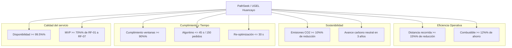

# PathSeek

**Optimizador de Rutas Sostenibles para UGEL Huancayo**

## Presentación

**PathSeek** es una plataforma web de optimización de rutas de distribución de última milla para **UGEL Huancayo**, institución educativa con operaciones logísticas. El sistema resuelve el Problema de Ruteo de Vehículos con Ventanas de Tiempo (VRPTW) y consideraciones ambientales (Green VRP) mediante metaheurísticas (Algoritmos Genéticos, Búsqueda Tabú, Colonia de Hormigas o Enfriamiento Simulado).

### Datos clave del proyecto

| Campo | Detalle |
| ----- | ------- |
| **Nombre del proyecto** | PathSeek |
| **Organización / Cliente** | UGEL Huancayo |
| **Ubicación** | Atalaya 1280, Huancayo 12006, Perú |
| **Tipo de solución** | Plataforma web de optimización de rutas sostenibles |
| **Área** | Logística y distribución de última milla |
| **Equipo** | Equipo PIPRE (Desarrollo) |
| **Supervisor / Docente** | Ing. Daniel Gamarra |
| **Duración** | 14 semanas (4 iteraciones) |
| **Enfoque** | Híbrido con dominancia ágil (iterativo-incremental) |
| **Presupuesto** | S/ 500,000 (MVP) + S/ 120,000 anual operativo |
| **Versión documento** | V_1_0_0 |

## Índice de documentación

La documentación completa reside en `docs/01 Inicio/`. Cada documento es accesible desde su vínculo relativo.

| Doc | Archivo | Descripción |
| --- | ------- | ----------- |
| 01 | [01. Selección del enfoque del proyecto V_1_0_0.md](docs/01%20Inicio/01.%20Selecci%C3%B3n%20del%20enfoque%20del%20proyecto%20V_1_0_0.md) | Enfoque híbrido con dominancia ágil |
| 02 | [02. Acta de constitución V_1_0_0.md](docs/01%20Inicio/02.%20Acta%20de%20constituci%C3%B3n%20V_1_0_0.md) | Propósito, objetivos, hitos, presupuesto, riesgos |
| 03 | [03. Declaración de la visión V_1_0_0.md](docs/01%20Inicio/03.%20Declaraci%C3%B3n%20de%20la%20visi%C3%B3n%20V_1_0_0.md) | Visión, KPIs, capacidades del producto |
| 04 | [04. Registro de supuestos y restricciones V_1_0_0.md](docs/01%20Inicio/04.%20Registro%20de%20supuestos%20y%20restricciones%20V_1_0_0.md) | Supuestos y restricciones del proyecto |
| 05 | [05. Registro de interesados V_1_0_0.md](docs/01%20Inicio/05.%20Registro%20de%20interesados%20V_1_0_0.md) | Interesados, RBAC y comunicación |
| 06 | [06. Requisitos funcionales V_1_0_0.md](docs/01%20Inicio/06.%20Requisitos%20funcionales%20V_1_0_0.md) | Catálogo RF-001 a RF-010 |
| 07 | [07. Requisitos no funcionales V_1_0_0.md](docs/01%20Inicio/07.%20Requisitos%20no%20funcionales%20V_1_0_0.md) | Escenarios de calidad RNF-001 a RNF-009 |
| 08 | [08. Usuarios V_1_0_0.md](docs/01%20Inicio/08.%20Usuarios%20V_1_0_0.md) | Roles, historias de uso, matriz RBAC |
| 09 | [09. Reglas de negocio V_1_0_0.md](docs/01%20Inicio/09.%20Reglas%20de%20negocio%20V_1_0_0.md) | Reglas RN-001 a RN-012 y trazabilidad |
| 10 | [10. Stack tecnológico V_1_0_0.md](docs/01%20Inicio/10.%20Stack%20tecnol%C3%B3gico%20V_1_0_0.md) | Evaluación y selección del stack |
| 11 | [11. Base de datos V_1_0_0.md](docs/01%20Inicio/11.%20Base%20de%20datos%20V_1_0_0.md) | Modelo conceptual, lógico, físico (DDL) |
| 12 | [12. Modelo C4 V_1_0_0.md](docs/01%20Inicio/12.%20Modelo%20C4%20V_1_0_0.md) | Arquitectura de software (contexto, contenedores, componentes) |
| 13 | [13. Restricciones V_1_0_0.md](docs/01%20Inicio/13.%20Restricciones%20V_1_0_0.md) | Análisis multidimensional de restricciones |

## Resumen de objetivos y KPIs

Diagrama Mermaid con el resumen de los objetivos y KPIs recurrentes en la documentación:

## Puntos comunes en todos los documentos

Los siguientes elementos se repiten de forma consistente en todos los documentos:

### Nombre y código del proyecto

- **Proyecto:** PathSeek
- **Código de documento:** DOC-001 a DOC-013 (secuencial por documento)
- **Versión:** V_1_0_0 (versión inicial)
- **Fecha:** 2026-08-25
- **Responsable:** Equipo del proyecto

### Organización y actores

- **Cliente:** UGEL Huancayo
- **Equipo de desarrollo:** Equipo PIPRE
- **Supervisor académico:** Ing. Daniel Gamarra

### Problema que resuelve

- Congestión vehicular en horas punta.
- Costos de combustible y mantenimiento (35% de costos totales).
- Emisiones de ~3.5 toneladas de CO₂ mensuales (flota de 15 camionetas).
- 22% de incumplimiento de ventanas de tiempo.

### Objetivos y KPIs (recurrentes)

- Reducción de distancia recorrida ≥ 15%.
- Reducción de emisiones CO₂ ≥ 10%.
- Cumplimiento de ventanas ≥ 90%.
- Algoritmo en ≤ 45 s para 150 pedidos / 15 vehículos.
- Re-optimización en ≤ 30 s.
- Disponibilidad ≥ 99.5%.
- MVP con ≥ 70% de RF-01 a RF-07.

### Stack tecnológico

**Backend:** Node.js + Express · **Frontend:** Angular · **Base de datos:** PostgreSQL · **Mapas:** Leaflet / OpenStreetMap · **Caché:** Redis

Ver la [lista de justificaciones](docs/01%20Inicio/10.%20Stack%20tecnol%C3%B3gico%20V_1_0_0.md) completa en el documento 10.

#### Justificaciones de la elección (Angular + Express)

1. **Lenguaje unificado (JavaScript/TypeScript):** Frontend y backend comparten el mismo lenguaje, reduciendo la curva de aprendizaje del equipo y acelerando el MVP.
2. **Express como backend maduro:** Framework Node.js consolidado con ecosistema enorme de middleware y soporte masivo.
3. **TypeScript de extremo a extremo:** Angular usa TypeScript; al usarlo en Express se mantiene tipado estático, mejorando mantenibilidad.
4. **Angular como framework empresarial:** Arquitectura completa (componentes, DI, routing, formularios, HTTP) para dashboard, mapas y reportes.
5. **Escalabilidad (Node async I/O):** Maneja concurrencia (dashboard en tiempo real, tráfico) cumpliendo 1,000 pedidos / 50 vehículos.
6. **Optimización con librerías JS/TS:** Metaheurísticas disponibles para VRPTW/Green VRP en ≤ 45 s.
7. **Costo de infraestructura moderado:** Consumo eficiente, alineado al presupuesto y criterios eco-diseño.
8. **Código abierto:** Express, Angular y PostgreSQL cumplen RES-07.
9. **PostgreSQL:** Soporte geográfico (PostGIS) para rutas y coordenadas.
10. **Componentes reutilizables:** Aceleran RF-004, RF-005 y RF-010.

### Estándares y normativa (aplicados en todos)

- ISO/IEC 25010 (calidad de software)
- OWASP Top 10 (seguridad)
- WCAG 2.1 AA (accesibilidad)
- ISO 14083 (huella de carbono logística)
- Ley N.° 29733 (Protección de Datos Personales)
- Ley N.° 30224 (Ley de Tránsito)
- Decreto Supremo N.° 033-2012-MTC (restricción vehicular)
- W3C (validación de código)

## Convenciones de archivos

- **Formato:** Markdown (`.md`) nativo con encabezados, tablas, diagramas Mermaid y fragmentos SQL.
- **Nomenclatura:** `NN. Nombre del documento V_1_0_0.md` en `docs/01 Inicio/`.
- **Versionamiento:** La versión inicial es `V_1_0_0.md`; cambios menores `V_1_1_0`; revisiones estructurales `V_2_0_0`. Se preserva el historial en Git.
- **Calidad de requisitos:** Prohibidos términos ambiguos ("fácil", "eficiente", "adecuado") y diseño técnico prematuro en descripciones atómicas.

## Fuentes de verdad

La documentación se genera a partir de:

- [requirements.md](requirements.md) — Consigna del proyecto (requerimientos, restricciones, estándares).
- [rules2.md](rules2.md) — Normas de entrega de los 9 documentos de arquitectura, ingeniería de requisitos e impacto multidimensional.
- Docs existentes en `docs/01 Inicio/` (01-05).

## Cómo leer

1. Inicia con `requirements.md` y `rules2.md` para el contexto y las reglas.
2. Revisa `docs/01 Inicio/` en orden numérico (01 → 13) para una lectura secuencial.
3. Cada documento incluye su propio "Control de versiones" y "Referencia" al final.
