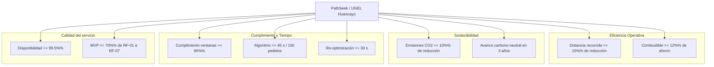

# PathSeek

**Optimizador de Rutas Sostenibles para UGEL Huancayo**

## Presentación

**PathSeek** es una plataforma web de optimización de rutas de distribución de última milla para **UGEL Huancayo**, institución educativa con operaciones logísticas. El sistema resuelve el Problema de Ruteo de Vehículos con Ventanas de Tiempo (VRPTW) y consideraciones ambientales (Green VRP) mediante metaheurísticas (Algoritmos Genéticos, Búsqueda Tabú, Colonia de Hormigas o Enfriamiento Simulado).

### Datos clave del proyecto

| Campo                      | Detalle                                             |
| -------------------------- | --------------------------------------------------- |
| **Nombre del proyecto**    | PathSeek                                            |
| **Organización / Cliente** | UGEL Huancayo                                       |
| **Ubicación**              | Atalaya 1280, Huancayo 12006, Perú                  |
| **Tipo de solución**       | Plataforma web de optimización de rutas sostenibles |
| **Área**                   | Logística y distribución de última milla            |
| **Equipo**                 | Equipo PIPRE (Desarrollo)                           |
| **Supervisor / Docente**   | Ing. Daniel Gamarra                                 |
| **Duración**               | 14 semanas (4 iteraciones)                          |
| **Enfoque**                | Híbrido con dominancia ágil (iterativo-incremental) |
| **Presupuesto**            | S/ 500,000 (MVP) + S/ 120,000 anual operativo       |
| **Versión documento**      | V_1_0_0                                             |

## Índice de documentación

La documentación completa reside en `docs/01 Inicio/` (Fase 01) y `docs/02 Planificación/` (Fase 02). Cada documento es accesible desde su vínculo relativo.

| Doc | Archivo                                                                                                                                   | Descripción                                                    |
| --- | ----------------------------------------------------------------------------------------------------------------------------------------- | -------------------------------------------------------------- |
| 01  | [01. Selección del enfoque del proyecto V_1_0_0.md](docs/01%20Inicio/01.%20Selecci%C3%B3n%20del%20enfoque%20del%20proyecto%20V_1_0_0.md)  | Enfoque híbrido con dominancia ágil                            |
| 02  | [02. Acta de constitución V_1_0_0.md](docs/01%20Inicio/02.%20Acta%20de%20constituci%C3%B3n%20V_1_0_0.md)                                  | Propósito, objetivos, hitos, presupuesto, riesgos              |
| 03  | [03. Declaración de la visión V_1_0_0.md](docs/01%20Inicio/03.%20Declaraci%C3%B3n%20de%20la%20visi%C3%B3n%20V_1_0_0.md)                   | Visión, KPIs, capacidades del producto                         |
| 04  | [04. Registro de supuestos y restricciones V_1_0_0.md](docs/01%20Inicio/04.%20Registro%20de%20supuestos%20y%20restricciones%20V_1_0_0.md) | Supuestos y restricciones del proyecto                         |
| 05  | [05. Registro de interesados V_1_0_0.md](docs/01%20Inicio/05.%20Registro%20de%20interesados%20V_1_0_0.md)                                 | Interesados, RBAC y comunicación                               |
| 06  | [06. Requisitos funcionales V_1_0_0.md](docs/01%20Inicio/06.%20Requisitos%20funcionales%20V_1_0_0.md)                                     | Catálogo RF-001 a RF-010                                       |
| 07  | [07. Requisitos no funcionales V_1_0_0.md](docs/01%20Inicio/07.%20Requisitos%20no%20funcionales%20V_1_0_0.md)                             | Escenarios de calidad RNF-001 a RNF-009                        |
| 08  | [08. Usuarios V_1_0_0.md](docs/01%20Inicio/08.%20Usuarios%20V_1_0_0.md)                                                                   | Roles, historias de uso, matriz RBAC                           |
| 09  | [09. Reglas de negocio V_1_0_0.md](docs/01%20Inicio/09.%20Reglas%20de%20negocio%20V_1_0_0.md)                                             | Reglas RN-001 a RN-012 y trazabilidad                          |
| 10  | [10. Stack tecnológico V_1_0_0.md](docs/01%20Inicio/10.%20Stack%20tecnol%C3%B3gico%20V_1_0_0.md)                                          | Evaluación y selección del stack                               |
| 11  | [11. Base de datos V_1_0_0.md](docs/01%20Inicio/11.%20Base%20de%20datos%20V_1_0_0.md)                                                     | Modelo conceptual, lógico, físico (DDL)                        |
| 12  | [12. Modelo C4 V_1_0_0.md](docs/01%20Inicio/12.%20Modelo%20C4%20V_1_0_0.md)                                                               | Arquitectura de software (contexto, contenedores, componentes) |
| 13  | [13. Restricciones V_1_0_0.md](docs/01%20Inicio/13.%20Restricciones%20V_1_0_0.md)                                                         | Análisis multidimensional de restricciones                     |

## Fase 02: Planificación del Proyecto

La documentación de la Fase 02 reside en `docs/02 Planificación/`. Cada documento es accesible desde su vínculo relativo.

| Doc | Archivo                                                                                                               | Descripción                                                                            |
| --- | --------------------------------------------------------------------------------------------------------------------- | -------------------------------------------------------------------------------------- |
| 14  | [01 Transformando a ágil V_1_0_0.md](docs/02%20Planificaci%C3%B3n/01%20Transformando%20a%20%C3%A1gil%20V_1_0_0.md)    | Transformación de RF/RNF a Épicas, Historias de Usuario, Enablers y Definition of Done |
| 15  | [02 Artefactos Jira V_1_0_0.md](docs/02%20Planificaci%C3%B3n/02%20Artefactos%20Jira%20V_1_0_0.md)                     | Configuración de Jira Software: jerarquía, backlog, roadmap, sprint y releases         |
| 16  | [03 Registro de riesgos V_1_0_0.md](docs/02%20Planificaci%C3%B3n/03%20Registro%20de%20riesgos%20V_1_0_0.md)           | Matriz de riesgos con severidad P × I y planes de mitigación/contingencia              |
| 17  | [04 Presupuesto del proyecto V_1_0_0.md](docs/02%20Planificaci%C3%B3n/04%20Presupuesto%20del%20proyecto%20V_1_0_0.md) | CAPEX RRHH, licenciamiento, OPEX Cloud y reserva de contingencia                       |

## Resumen de objetivos y KPIs

Diagrama Mermaid con el resumen de los objetivos y KPIs recurrentes en la documentación:

```mermaid
graph TD
    subgraph Eficiencia Operativa
        A[Distancia recorrida >= 15%% de reducción]
        B[Combustible >= 12%% de ahorro]
    end
    subgraph Sostenibilidad
        C[Emisiones CO2 >= 10%% de reducción]
        D[Avance carbono neutral en 3 años]
    end
    subgraph Cumplimiento y Tiempo
        E[Cumplimiento ventanas >= 90%%]
        F[Algoritmo <= 45 s / 150 pedidos]
        G[Re-optimización <= 30 s]
    end
    subgraph Calidad del servicio
        H[Disponibilidad >= 99.5%%]
        I[MVP >= 70%% de RF-01 a RF-07]
    end

    PathSeek[PathSeek / UGEL Huancayo] --> A
    PathSeek --> B
    PathSeek --> C
    PathSeek --> D
    PathSeek --> E
    PathSeek --> F
    PathSeek --> G
    PathSeek --> H
    PathSeek --> I
```

## Puntos comunes en todos los documentos

Los siguientes elementos se repiten de forma consistente en todos los documentos:

### Nombre y código del proyecto

- **Proyecto:** PathSeek
- **Código de documento:** DOC-001 a DOC-013 (secuencial por documento)
- **Versión:** V_1_0_0 (versión inicial)
- **Fecha:** 2026-08-25
- **Responsable:** Equipo del proyecto

### Organización y actores

- **Cliente:** UGEL Huancayo
- **Equipo de desarrollo:** Equipo PIPRE
- **Supervisor académico:** Ing. Daniel Gamarra

### Problema que resuelve

- Congestión vehicular en horas punta.
- Costos de combustible y mantenimiento (35% de costos totales).
- Emisiones de ~3.5 toneladas de CO₂ mensuales (flota de 15 camionetas).
- 22% de incumplimiento de ventanas de tiempo.

### Objetivos y KPIs (recurrentes)

- Reducción de distancia recorrida ≥ 15%.
- Reducción de emisiones CO₂ ≥ 10%.
- Cumplimiento de ventanas ≥ 90%.
- Algoritmo en ≤ 45 s para 150 pedidos / 15 vehículos.
- Re-optimización en ≤ 30 s.
- Disponibilidad ≥ 99.5%.
- MVP con ≥ 70% de RF-01 a RF-07.

### Stack tecnológico

**Backend:** Node.js + Express · **Frontend:** Flutter (Dart) · **Base de datos:** PostgreSQL · **Mapas:** flutter_map / OpenStreetMap · **Caché:** Redis

**Arquitectura:** **Cliente-Servidor** — el frontend SPA Flutter (web para operador/dashboard y modo móvil para conductor, con caché offline) es el cliente, y consume la API REST de Node.js/Express (servidor único) mediante HTTPS/JSON. El servidor centraliza la lógica de negocio, la persistencia (PostgreSQL/Redis) y el módulo de optimización.

Ver la [lista de justificaciones](docs/01%20Inicio/10.%20Stack%20tecnol%C3%B3gico%20V_1_0_0.md) completa en el documento 10.

#### Justificaciones de la elección (Flutter + Express)

1. **Frontend multi-plataforma (Flutter/Dart):** Flutter usa Dart (tipado estático, hot reload, compilación nativa). Una sola base de código cubre web (operador/dashboard) y móvil (conductor), acelerando el MVP.
2. **Express como backend maduro:** Framework Node.js consolidado con ecosistema enorme de middleware y soporte masivo.
3. **Tipado estático en todo el stack:** Frontend en Dart (null safety) y backend en TypeScript; mantenibilidad y calidad en toda la solución.
4. **Flutter como framework empresarial:** UI declarativa por widgets, gestión de estado con Provider/BLoC, navegación con Navigator/go_router, formularios con validación y clientes HTTP (http/dio) para dashboard, mapas y reportes.
5. **Escalabilidad (Node async I/O):** Maneja concurrencia (dashboard en tiempo real, tráfico) cumpliendo 1,000 pedidos / 50 vehículos.
6. **Optimización con librerías JS/TS:** Metaheurísticas disponibles para VRPTW/Green VRP en ≤ 45 s.
7. **Costo de infraestructura moderado:** Consumo eficiente, alineado al presupuesto y criterios eco-diseño.
8. **Código abierto:** Express, Flutter y PostgreSQL cumplen RES-07.
9. **PostgreSQL:** Soporte geográfico (PostGIS) para rutas y coordenadas.
10. **Componentes reutilizables:** Widgets reutilizables de Flutter aceleran RF-004, RF-005 y RF-010.
11. **Arquitectura cliente-servidor:** Frontend Flutter (cliente, web + móvil con offline) ↔ API REST Node.js/Express (servidor único) por HTTPS, con separación de responsabilidades y escalamiento independiente del servidor.

### Estándares y normativa (aplicados en todos)

- ISO/IEC 25010 (calidad de software)
- OWASP Top 10 (seguridad)
- WCAG 2.1 AA (accesibilidad)
- ISO 14083 (huella de carbono logística)
- Ley N.° 29733 (Protección de Datos Personales)
- Ley N.° 30224 (Ley de Tránsito)
- Decreto Supremo N.° 033-2012-MTC (restricción vehicular)
- W3C (validación de código)

## Convenciones de archivos

- **Formato:** Markdown (`.md`) nativo con encabezados, tablas, diagramas Mermaid y fragmentos SQL.
- **Nomenclatura:** `NN. Nombre del documento V_1_0_0.md` en `docs/01 Inicio/`; en `docs/02 Planificación/` los artefactos usan `NN Nombre del documento V_1_0_0.md`.
- **Versionamiento:** La versión inicial es `V_1_0_0.md`; cambios menores `V_1_1_0`; revisiones estructurales `V_2_0_0`. Se preserva el historial en Git.
- **Calidad de requisitos:** Prohibidos términos ambiguos ("fácil", "eficiente", "adecuado") y diseño técnico prematuro en descripciones atómicas.

## Fuentes de verdad

La documentación se genera a partir de la consigna del proyecto "PathSeek" – Optimizador de Rutas Sostenibles para UGEL Huancayo, y de los documentos existentes en `docs/01 Inicio/` (01-05). Los archivos referenciales originales (`requirements.md`, `rules2.md`) fueron solo de referencia y ya no forman parte del repositorio.

## Cómo leer

1. Revisa `docs/01 Inicio/` en orden numérico (01 → 13) para una lectura secuencial.
2. Cada documento incluye su propio "Control de versiones" y "Referencia" al final.
