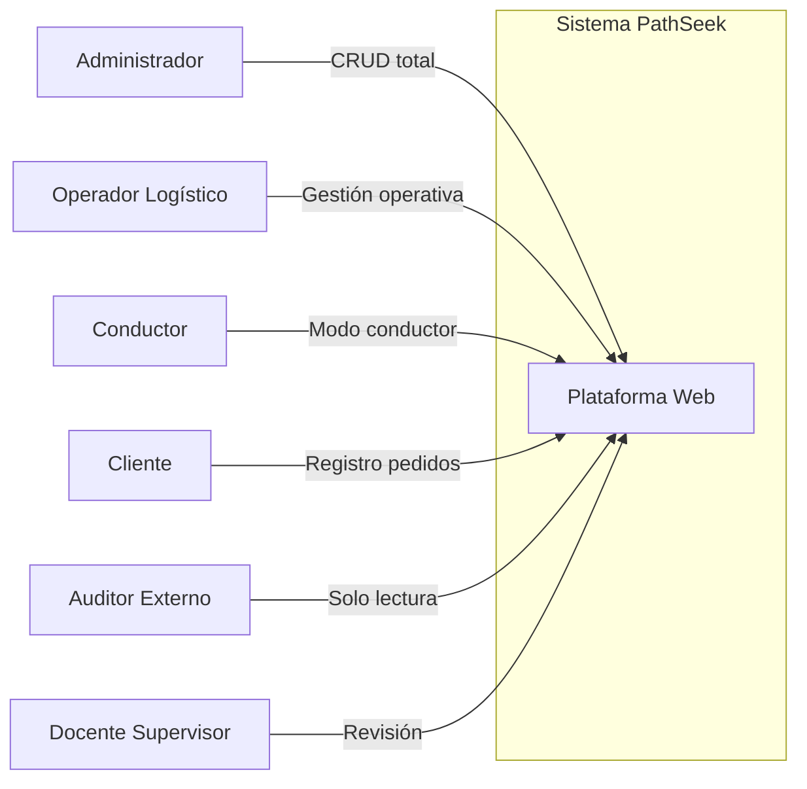

# Usuarios y Perfiles del Sistema

Proyecto: PathSeek
Código del documento: DOC-008
Versión: V_1_0_0
Fecha: 2026-08-25

---

## 1. Matriz de Roles y Actores

### 1.1 Actores directos

| ID | Rol | Descripción | Nivel de Expertise |
| ---- | ------------------------- | ----------- | ------------------ |
| USR-01 | Administrador del sistema | Gestiona configuración, parámetros, usuarios y reportes globales | Alto |
| USR-02 | Operador logístico | Registra pedidos, genera rutas, supervisa dashboard, gestiona flota y conductores | Medio |
| USR-03 | Conductor | Consulta ruta asignada, entregas pendientes y alertas de tráfico (modo conductor) | Básico |
| USR-04 | Cliente | Registra preferencias de entrega, horarios y restricciones de acceso | Básico |

### 1.2 Actores indirectos

| ID | Rol | Descripción |
| ---- | ------------------------- | ----------- |
| USR-05 | Auditor externo | Consulta logs de auditoría y reportes de cumplimiento normativo |
| USR-06 | Docente supervisor | Revisa documentación, resultados de pruebas y justificación de decisiones |
| USR-07 | Equipo de desarrollo | Desarrolla, mantiene y mejora el sistema |

---

## 2. Historias de Uso Resumidas

| ID | Perfil | Interacción Principal | Frecuencia |
| ---- | ------------------------- | ------------------------------------------- | ---------- |
| HU-01 | Administrador | Configurar parámetros, gestionar usuarios, generar reportes globales | Diaria |
| HU-02 | Operador logístico | Registrar pedidos, generar rutas, supervisar dashboard, gestionar flota/conductores | Diaria |
| HU-03 | Conductor | Consultar ruta asignada, marcar entregas, recibir alertas de tráfico | Por turno |
| HU-04 | Cliente | Registrar preferencias de entrega y consultar estado de pedidos | Semanal |
| HU-05 | Auditor externo | Consultar logs de auditoría y reportes de cumplimiento | Mensual |
| HU-06 | Docente supervisor | Revisar documentación y resultados del proyecto | Por iteración |

---

## 3. Matriz de Control de Acceso (RBAC)

| Módulo / Capacidad | Administrador | Operador | Conductor | Cliente | Auditor |
| -------------------------- | :-----------: | :------: | :-------: | :-----: | :-----: |
| Configuración del sistema | CRUD | Lectura | Sin Acceso | Sin Acceso | Lectura |
| Gestión de flota | CRUD | CRUD | Lectura (propia) | Sin Acceso | Lectura |
| Gestión de pedidos | CRUD | CRUD | Lectura (asignados) | Crear / Lectura | Lectura |
| Gestión de conductores | CRUD | CRUD | Lectura (propia) | Sin Acceso | Lectura |
| Generación de rutas | CRUD | CRUD | Sin Acceso | Sin Acceso | Lectura |
| Visualización de mapa | Lectura | Lectura | Lectura (ruta propia) | Lectura (pedido propio) | Lectura |
| Dashboard de indicadores | Lectura | Lectura | Lectura (básica) | Sin Acceso | Lectura |
| Reportes PDF | CRUD | Crear / Lectura | Sin Acceso | Lectura (propia) | Lectura |
| Re-optimización dinámica | CRUD | CRUD | Sin Acceso | Sin Acceso | Lectura |
| Logs de auditoría | Lectura | Sin Acceso | Sin Acceso | Sin Acceso | Lectura |
| Modo conductor | Sin Acceso | Sin Acceso | Lectura / Actualización | Sin Acceso | Sin Acceso |
| Plan de compensación carbono | CRUD | Lectura | Sin Acceso | Sin Acceso | Lectura |

---

## 4. Descripción de Roles

### Administrador

- Acceso total a configuración del sistema, gestión de usuarios y reportes globales.
- Crea, lee, actualiza y elimina registros en todos los módulos.
- Responsable de la configuración de parámetros generales.

### Operador Logístico

- Gestión operativa completa: flota, pedidos, conductores, rutas, dashboard y reportes.
- No puede modificar configuración del sistema ni acceder a logs de auditoría.
- Genera y supervisa la planificación de rutas.

### Conductor

- Acceso limitado a su ruta asignada, entregas pendientes y alertas de tráfico.
- Puede actualizar el estado de entregas (completada, pendiente, incidente).
- No puede crear, modificar o eliminar registros del sistema.

### Cliente

- Acceso mínimo: crea pedidos y registra preferencias de entrega.
- Consulta el estado de sus propios pedidos.
- No tiene acceso a información de otros clientes ni a datos operativos.

### Auditor Externo

- Solo lectura sobre logs de auditoría y reportes de cumplimiento.
- No puede modificar ningún dato del sistema.

---

## 5. Diagrama de Actores

---

## 6. Requisitos de Autenticación y Autorización

| Requisito | Descripción |
| --------- | ----------- |
| Autenticación | JWT con tokens de corta duración; refresh tokens para sesiones prolongadas |
| Autorización | RBAC por rol; control de acceso a nivel de módulo y acción |
| Sesiones | Timeout de sesión inactiva: 30 minutos |
| Contraseñas | Mínimo 8 caracteres, complejidad mixta; hashes con bcrypt |
| Bloqueo | Bloqueo tras 3 intentos fallidos por 15 minutos (RN-001) |

---

## 7. Control de versiones

| Versión | Fecha | Descripción | Responsable |
| ------- | ---------- | ----------------------------------------- | ------------------- |
| V_1_0_0 | 2026-08-25 | Creación inicial del documento de usuarios | Equipo del proyecto |

---

## 8. Referencia

**Fuente principal:** Consigna de proyecto "PathSeek" – Optimizador de Rutas Sostenibles para UGEL Huancayo.
