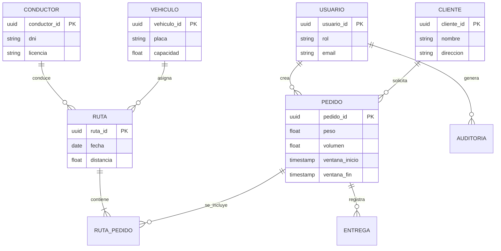

# Diseño e Ingeniería de Base de Datos

Proyecto: PathSeek
Código del documento: DOC-011
Versión: V_1_0_0
Fecha: 2026-08-25

---

## 1. Modelo Conceptual (Entidad-Relación)



---

## 2. Modelo Lógico

### 2.1 Entidades y atributos

| Entidad | Atributos | PK | FK | Normalización |
| ------- | --------- | -- | -- | ------------- |
| usuarios | usuario_id, nombre, email, password_hash, rol, estado, creado_en | usuario_id | — | 3FN |
| conductores | conductor_id, usuario_id, dni, nombre, licencia, categoria, experiencia, disponible, contacto | conductor_id | usuario_id | 3FN |
| vehiculos | vehiculo_id, placa, tipo, capacidad_kg, capacidad_m3, consumo_km_l, factor_emision, anio, restriccion_placa | vehiculo_id | — | 3FN |
| clientes | cliente_id, usuario_id, nombre, direccion, punto_referencia, telefono, horario_atencion | cliente_id | usuario_id | 3FN |
| pedidos | pedido_id, cliente_id, direccion, gps_lat, gps_lon, peso, volumen, ventana_inicio, ventana_fin, prioridad, tipo_producto, estado | pedido_id | cliente_id | 3FN |
| rutas | ruta_id, fecha, conductor_id, vehiculo_id, distancia_km, co2, combustible, estado | ruta_id | conductor_id, vehiculo_id | 3FN |
| ruta_pedidos | ruta_id, pedido_id, orden, hora_estimada, cumplio_ventana | (ruta_id, pedido_id) | ruta_id, pedido_id | 3FN |
| auditoria | auditoria_id, usuario_id, accion, entidad, fecha, ip | auditoria_id | usuario_id | 3FN |

### 2.2 Nivel de normalización

Todas las entidades se normalizan a la **3FN**, eliminando dependencias transitivas y parciales.

---

## 3. Modelo Físico (DDL SQL)

```sql
CREATE TABLE usuarios (
    usuario_id UUID PRIMARY KEY DEFAULT gen_random_uuid(),
    nombre VARCHAR(120) NOT NULL,
    email VARCHAR(255) NOT NULL UNIQUE,
    password_hash VARCHAR(255) NOT NULL,
    rol VARCHAR(20) NOT NULL DEFAULT 'OPERADOR',
    estado VARCHAR(20) NOT NULL DEFAULT 'ACTIVO',
    creado_en TIMESTAMP WITH TIME ZONE DEFAULT CURRENT_TIMESTAMP
);

CREATE INDEX idx_usuarios_email ON usuarios(email);

CREATE TABLE conductores (
    conductor_id UUID PRIMARY KEY DEFAULT gen_random_uuid(),
    usuario_id UUID NOT NULL REFERENCES usuarios(usuario_id),
    dni VARCHAR(8) NOT NULL UNIQUE,
    nombre VARCHAR(120) NOT NULL,
    licencia VARCHAR(20) NOT NULL,
    categoria VARCHAR(10) NOT NULL,
    experiencia INT NOT NULL,
    disponible BOOLEAN DEFAULT TRUE,
    contacto VARCHAR(15)
);

CREATE TABLE vehiculos (
    vehiculo_id UUID PRIMARY KEY DEFAULT gen_random_uuid(),
    placa VARCHAR(10) NOT NULL UNIQUE,
    tipo VARCHAR(20) NOT NULL,
    capacidad_kg NUMERIC(10,2) NOT NULL,
    capacidad_m3 NUMERIC(10,2) NOT NULL,
    consumo_km_l NUMERIC(6,2) NOT NULL,
    factor_emision NUMERIC(6,3) NOT NULL,
    anio INT NOT NULL,
    restriccion_placa_digito INT
);

CREATE TABLE clientes (
    cliente_id UUID PRIMARY KEY DEFAULT gen_random_uuid(),
    usuario_id UUID NOT NULL REFERENCES usuarios(usuario_id),
    nombre VARCHAR(120) NOT NULL,
    direccion TEXT,
    punto_referencia TEXT,
    telefono VARCHAR(15)
);

CREATE TABLE pedidos (
    pedido_id UUID PRIMARY KEY DEFAULT gen_random_uuid(),
    cliente_id UUID NOT NULL REFERENCES clientes(cliente_id),
    direccion TEXT NOT NULL,
    gps_lat NUMERIC(10,7) NOT NULL,
    gps_lon NUMERIC(10,7) NOT NULL,
    peso NUMERIC(10,2) NOT NULL,
    volumen NUMERIC(10,2) NOT NULL,
    ventana_inicio TIME NOT NULL,
    ventana_fin TIME NOT NULL,
    prioridad VARCHAR(10) NOT NULL DEFAULT 'ESTANDAR',
    tipo_producto VARCHAR(20) NOT NULL,
    estado VARCHAR(20) NOT NULL DEFAULT 'PENDIENTE'
);

CREATE INDEX idx_pedidos_cliente ON pedidos(cliente_id);
CREATE INDEX idx_pedidos_estado ON pedidos(estado);

CREATE TABLE rutas (
    ruta_id UUID PRIMARY KEY DEFAULT gen_random_uuid(),
    fecha DATE NOT NULL,
    conductor_id UUID NOT NULL REFERENCES conductores(conductor_id),
    vehiculo_id UUID NOT NULL REFERENCES vehiculos(vehiculo_id),
    distancia_km NUMERIC(10,2) NOT NULL,
    co2_kg NUMERIC(10,2) NOT NULL,
    combustible_l NUMERIC(10,2) NOT NULL,
    estado VARCHAR(20) NOT NULL DEFAULT 'PLANIFICADA'
);

CREATE TABLE ruta_pedidos (
    ruta_id UUID NOT NULL REFERENCES rutas(ruta_id),
    pedido_id UUID NOT NULL REFERENCES pedidos(pedido_id),
    orden INT NOT NULL,
    hora_estimada TIME,
    cumplio_ventana BOOLEAN,
    PRIMARY KEY (ruta_id, pedido_id)
);

CREATE TABLE auditoria (
    auditoria_id UUID PRIMARY KEY DEFAULT gen_random_uuid(),
    usuario_id UUID NOT NULL REFERENCES usuarios(usuario_id),
    accion VARCHAR(50) NOT NULL,
    entidad VARCHAR(50) NOT NULL,
    fecha TIMESTAMP WITH TIME ZONE DEFAULT CURRENT_TIMESTAMP,
    ip VARCHAR(45)
);
```

---

## 4. Índices Adicionales

```sql
CREATE INDEX idx_rutas_fecha ON rutas(fecha);
CREATE INDEX idx_pedidos_ventana ON pedidos(ventana_inicio, ventana_fin);
CREATE INDEX idx_ruta_pedidos_ruta ON ruta_pedidos(ruta_id);
```

---

## 5. Control de versiones

| Versión | Fecha | Descripción | Responsable |
| ------- | ---------- | ----------------------------------------- | ------------------- |
| V_1_0_0 | 2026-08-25 | Creación inicial del diseño de base de datos | Equipo del proyecto |

---

## 6. Referencia

**Fuente principal:** Consigna de proyecto "PathSeek" – Optimizador de Rutas Sostenibles para UGEL Huancayo.
**Marco de referencia:** rules2.md, requirements.md.
