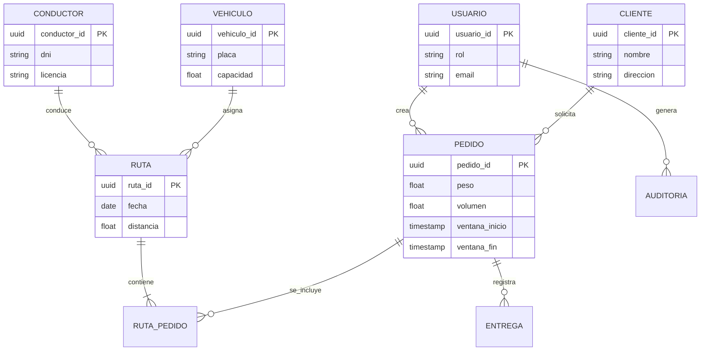

# Diseño e Ingeniería de Base de Datos

Proyecto: PathSeek
Código del documento: DOC-011
Versión: V_1_1_0
Fecha: 2026-09-29

---

## 1. Modelo Conceptual (Entidad-Relación)


```mermaid
erDiagram
    USUARIO ||--o{ PEDIDO : crea
    CONDUCTOR ||--o{ RUTA : conduce
    VEHICULO ||--o{ RUTA : asigna
    RUTA ||--|{ RUTA_PEDIDO : contiene
    PEDIDO ||--o{ RUTA_PEDIDO : se_incluye
    CLIENTE ||--o{ PEDIDO : solicita
    PEDIDO ||--o{ ENTREGA : registra
    USUARIO ||--o{ AUDITORIA : genera

    USUARIO {
        uuid usuario_id PK
        string rol
        string email
    }
    CONDUCTOR {
        uuid conductor_id PK
        string dni
        string licencia
    }
    VEHICULO {
        uuid vehiculo_id PK
        string placa
        float capacidad
    }
    CLIENTE {
        uuid cliente_id PK
        string nombre
        string direccion
    }
    PEDIDO {
        uuid pedido_id PK
        float peso
        float volumen
        timestamp ventana_inicio
        timestamp ventana_fin
    }
    RUTA {
        uuid ruta_id PK
        date fecha
        float distancia
    }
```

---

## 2. Modelo Lógico

### 2.1 Entidades y atributos

| Entidad | Atributos | PK | FK | Normalización |
| ------- | --------- | -- | -- | ------------- |
| usuarios | usuario_id, nombre, email, password_hash, rol, activo, intentos_fallidos, bloqueado_hasta, ultimo_login, created_at, updated_at | usuario_id | — | 3FN |
| refresh_tokens | refresh_token_id, usuario_id, token_hash, expires_at, last_used_at, revoked_at, created_at | refresh_token_id | usuario_id | 3FN |
| conductores | conductor_id, usuario_id (opcional, sin FK), dni, nombre, licencia, categoria, experiencia, disponible, contacto, created_at, updated_at | conductor_id | — | 3FN |
| vehiculos | vehiculo_id, placa, tipo, capacidad_kg, capacidad_m3, consumo_km_l, factor_emision, anio, restriccion_placa_digito, created_at, updated_at | vehiculo_id | — | 3FN |
| pedidos | pedido_id, cliente_id (texto libre, sin FK hasta RF-009), direccion, gps_lat, gps_lon, peso, volumen, ventana_inicio, ventana_fin, prioridad, tipo_producto, estado, created_at, updated_at | pedido_id | — | 3FN |
| clientes | cliente_id, usuario_id, nombre, direccion, punto_referencia, telefono, horario_atencion | cliente_id | usuario_id | 3FN (objetivo RF-009, no implementado) |
| rutas | ruta_id, fecha, conductor_id, vehiculo_id, distancia_km, co2, combustible, estado | ruta_id | conductor_id, vehiculo_id | 3FN (objetivo RF-003, no implementado) |
| ruta_pedidos | ruta_id, pedido_id, orden, hora_estimada, cumplio_ventana | (ruta_id, pedido_id) | ruta_id, pedido_id | 3FN (objetivo RF-003, no implementado) |
| auditoria | auditoria_id, usuario_id, accion, entidad, fecha, ip | auditoria_id | usuario_id | 3FN (objetivo, no implementado) |

### 2.2 Nivel de normalización

Todas las entidades se normalizan a la **3FN**, eliminando dependencias transitivas y parciales.

---

## 3. Modelo Físico (DDL SQL)

> El DDL vigente es el de las migraciones Flyway `V1`, `V2` y `V3`
> (`backend/src/main/resources/db/migration/`). Hibernate valida
> (`ddl-auto: validate`) que las entidades coincidan con este esquema.

### 3.1 Tablas implementadas (MVP)

```sql
CREATE TABLE vehiculos (
    vehiculo_id UUID PRIMARY KEY,
    placa VARCHAR(10) NOT NULL UNIQUE,
    tipo VARCHAR(30) NOT NULL,
    capacidad_kg NUMERIC(10, 2) NOT NULL,
    capacidad_m3 NUMERIC(10, 2) NOT NULL,
    consumo_km_l NUMERIC(10, 2) NOT NULL,
    factor_emision NUMERIC(10, 4) NOT NULL,
    anio INTEGER,
    restriccion_placa_digito INTEGER,
    created_at TIMESTAMPTZ NOT NULL DEFAULT CURRENT_TIMESTAMP,
    updated_at TIMESTAMPTZ NOT NULL DEFAULT CURRENT_TIMESTAMP,
    CONSTRAINT chk_vehiculos_tipo CHECK (tipo IN ('CAMIONETA', 'FURGON', 'MOTO')),
    CONSTRAINT chk_vehiculos_capacidad_kg CHECK (capacidad_kg > 0),
    CONSTRAINT chk_vehiculos_capacidad_m3 CHECK (capacidad_m3 > 0),
    CONSTRAINT chk_vehiculos_consumo CHECK (consumo_km_l > 0),
    CONSTRAINT chk_vehiculos_factor_emision CHECK (factor_emision >= 0),
    CONSTRAINT chk_vehiculos_anio CHECK (anio IS NULL OR anio BETWEEN 1900 AND 2100),
    CONSTRAINT chk_vehiculos_restriccion CHECK (
        restriccion_placa_digito IS NULL OR restriccion_placa_digito BETWEEN 0 AND 9
    )
);

CREATE TABLE usuarios (
    usuario_id UUID PRIMARY KEY,
    nombre VARCHAR(120) NOT NULL,
    email VARCHAR(254) NOT NULL UNIQUE,
    password_hash VARCHAR(100) NOT NULL,
    rol VARCHAR(20) NOT NULL,
    activo BOOLEAN NOT NULL DEFAULT TRUE,
    intentos_fallidos INTEGER NOT NULL DEFAULT 0,
    bloqueado_hasta TIMESTAMPTZ,
    ultimo_login TIMESTAMPTZ,
    created_at TIMESTAMPTZ NOT NULL DEFAULT CURRENT_TIMESTAMP,
    updated_at TIMESTAMPTZ NOT NULL DEFAULT CURRENT_TIMESTAMP,
    CONSTRAINT chk_usuarios_rol CHECK (rol IN ('ADMIN', 'OPERADOR', 'CONDUCTOR', 'CLIENTE', 'AUDITOR')),
    CONSTRAINT chk_usuarios_intentos CHECK (intentos_fallidos >= 0),
    CONSTRAINT chk_usuarios_email_normalizado CHECK (email = LOWER(TRIM(email)))
);

CREATE TABLE refresh_tokens (
    refresh_token_id UUID PRIMARY KEY,
    usuario_id UUID NOT NULL,
    token_hash CHAR(64) NOT NULL UNIQUE,
    expires_at TIMESTAMPTZ NOT NULL,
    last_used_at TIMESTAMPTZ NOT NULL,
    revoked_at TIMESTAMPTZ,
    created_at TIMESTAMPTZ NOT NULL DEFAULT CURRENT_TIMESTAMP,
    CONSTRAINT fk_refresh_tokens_usuario
        FOREIGN KEY (usuario_id) REFERENCES usuarios (usuario_id) ON DELETE CASCADE
);

CREATE INDEX idx_refresh_tokens_usuario ON refresh_tokens (usuario_id);

CREATE TABLE conductores (
    conductor_id UUID PRIMARY KEY,
    usuario_id UUID,
    dni CHAR(8) NOT NULL UNIQUE,
    nombre VARCHAR(120) NOT NULL,
    licencia VARCHAR(20) NOT NULL UNIQUE,
    categoria VARCHAR(10) NOT NULL,
    experiencia INTEGER NOT NULL DEFAULT 0,
    disponible BOOLEAN NOT NULL DEFAULT TRUE,
    contacto VARCHAR(140),
    created_at TIMESTAMPTZ NOT NULL DEFAULT CURRENT_TIMESTAMP,
    updated_at TIMESTAMPTZ NOT NULL DEFAULT CURRENT_TIMESTAMP,
    CONSTRAINT chk_conductores_categoria CHECK (categoria IN ('AII', 'AIII', 'BII', 'BIII')),
    CONSTRAINT chk_conductores_experiencia CHECK (experiencia >= 0)
);

CREATE TABLE pedidos (
    pedido_id UUID PRIMARY KEY,
    cliente_id VARCHAR(120) NOT NULL,
    direccion VARCHAR(255) NOT NULL,
    gps_lat NUMERIC(9, 6) NOT NULL,
    gps_lon NUMERIC(9, 6) NOT NULL,
    peso NUMERIC(10, 2) NOT NULL,
    volumen NUMERIC(10, 2) NOT NULL,
    ventana_inicio VARCHAR(5) NOT NULL,
    ventana_fin VARCHAR(5) NOT NULL,
    prioridad VARCHAR(20) NOT NULL,
    tipo_producto VARCHAR(20) NOT NULL,
    estado VARCHAR(20) NOT NULL DEFAULT 'PENDIENTE',
    created_at TIMESTAMPTZ NOT NULL DEFAULT CURRENT_TIMESTAMP,
    updated_at TIMESTAMPTZ NOT NULL DEFAULT CURRENT_TIMESTAMP,
    CONSTRAINT chk_pedidos_gps_lat CHECK (gps_lat BETWEEN -90 AND 90),
    CONSTRAINT chk_pedidos_gps_lon CHECK (gps_lon BETWEEN -180 AND 180),
    CONSTRAINT chk_pedidos_peso CHECK (peso > 0),
    CONSTRAINT chk_pedidos_volumen CHECK (volumen > 0),
    CONSTRAINT chk_pedidos_ventana_orden CHECK (ventana_fin > ventana_inicio),
    CONSTRAINT chk_pedidos_prioridad CHECK (prioridad IN ('EXPRESS', 'ESTANDAR', 'ECONOMICO')),
    CONSTRAINT chk_pedidos_tipo_producto CHECK (tipo_producto IN ('PERECEDERO', 'NO_PERECEDERO')),
    CONSTRAINT chk_pedidos_estado CHECK (estado IN ('PENDIENTE', 'EN_RUTA', 'ENTREGADO', 'CANCELADO'))
);

CREATE INDEX idx_pedidos_cliente ON pedidos (cliente_id);
CREATE INDEX idx_pedidos_estado ON pedidos (estado);
```

Notas de diseño del MVP:

- `pedidos.cliente_id` es texto libre (sin FK) hasta implementar RF-009 (tabla `clientes`).
- `conductores.usuario_id` es opcional y sin FK: se vincula cuando el conductor recibe cuenta.
- Las ventanas de tiempo se guardan como `VARCHAR(5)` en formato `HH:mm` (el contrato con Flutter); la comparación lexicográfica equivale a la cronológica.
- `dni` y `token_hash` usan `CHAR` de longitud fija (siempre 8 y 64 caracteres).

### 3.2 Tablas objetivo (roadmap, no implementadas)

```sql
CREATE TABLE clientes (
    cliente_id UUID PRIMARY KEY DEFAULT gen_random_uuid(),
    usuario_id UUID NOT NULL REFERENCES usuarios(usuario_id),
    nombre VARCHAR(120) NOT NULL,
    direccion TEXT,
    punto_referencia TEXT,
    telefono VARCHAR(15)
);

CREATE TABLE rutas (
    ruta_id UUID PRIMARY KEY DEFAULT gen_random_uuid(),
    fecha DATE NOT NULL,
    conductor_id UUID NOT NULL REFERENCES conductores(conductor_id),
    vehiculo_id UUID NOT NULL REFERENCES vehiculos(vehiculo_id),
    distancia_km NUMERIC(10,2) NOT NULL,
    co2_kg NUMERIC(10,2) NOT NULL,
    combustible_l NUMERIC(10,2) NOT NULL,
    estado VARCHAR(20) NOT NULL DEFAULT 'PLANIFICADA'
);

CREATE TABLE ruta_pedidos (
    ruta_id UUID NOT NULL REFERENCES rutas(ruta_id),
    pedido_id UUID NOT NULL REFERENCES pedidos(pedido_id),
    orden INT NOT NULL,
    hora_estimada TIME,
    cumplio_ventana BOOLEAN,
    PRIMARY KEY (ruta_id, pedido_id)
);

CREATE TABLE auditoria (
    auditoria_id UUID PRIMARY KEY DEFAULT gen_random_uuid(),
    usuario_id UUID NOT NULL REFERENCES usuarios(usuario_id),
    accion VARCHAR(50) NOT NULL,
    entidad VARCHAR(50) NOT NULL,
    fecha TIMESTAMP WITH TIME ZONE DEFAULT CURRENT_TIMESTAMP,
    ip VARCHAR(45)
);
```

---

## 4. Índices Adicionales

```sql
CREATE INDEX idx_rutas_fecha ON rutas(fecha);
CREATE INDEX idx_pedidos_ventana ON pedidos(ventana_inicio, ventana_fin);
CREATE INDEX idx_ruta_pedidos_ruta ON ruta_pedidos(ruta_id);
```

---

## 5. Control de versiones

| Versión | Fecha | Descripción | Responsable |
| ------- | ---------- | ----------------------------------------- | ------------------- |
| V_1_0_0 | 2026-08-25 | Creación inicial del diseño de base de datos | Equipo del proyecto |
| V_1_1_0 | 2026-09-29 | DDL alineado a migraciones Flyway V1–V3 (tipos, nulabilidad, checks, refresh_tokens); tablas futuras marcadas como objetivo | Equipo del proyecto |

---

## 6. Referencia

**Fuente principal:** Consigna de proyecto "PathSeek" – Optimizador de Rutas Sostenibles para UGEL Huancayo.
