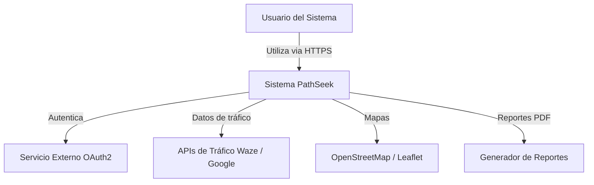
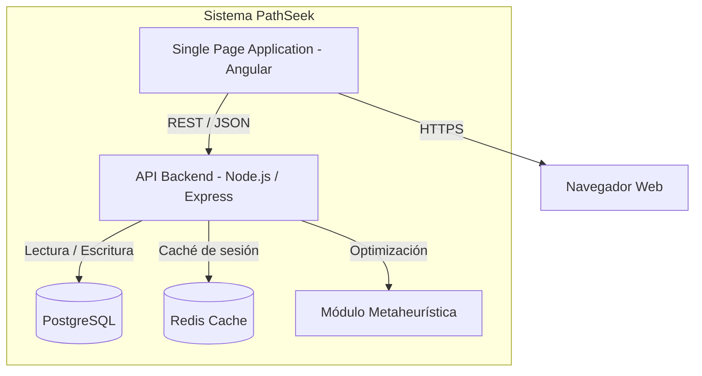
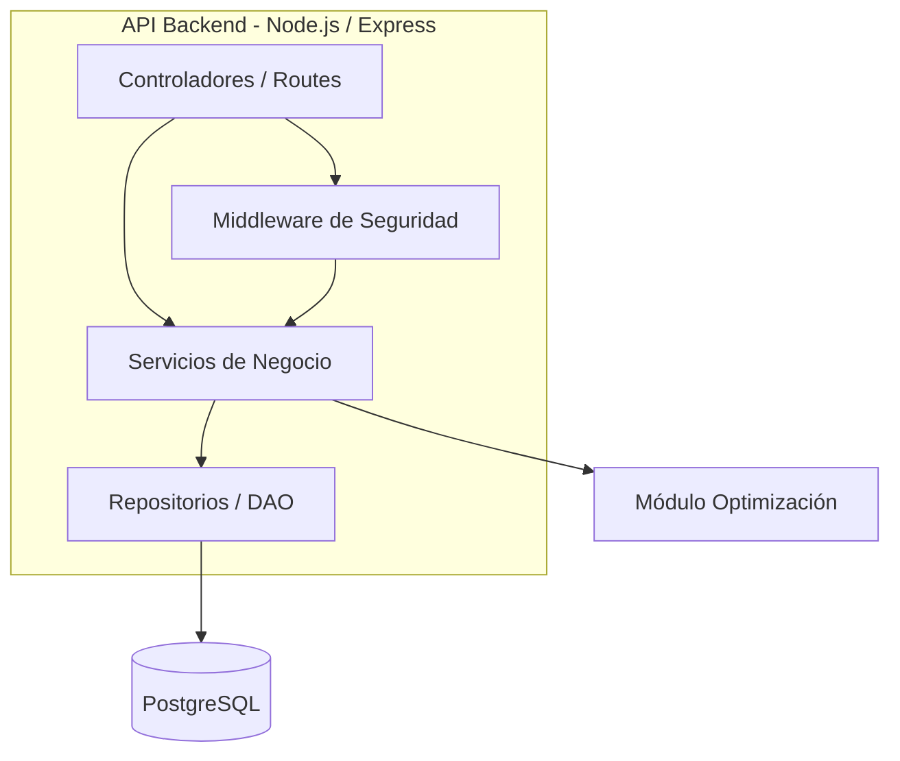
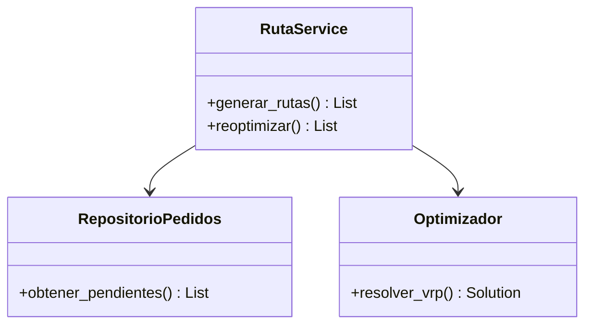

# Arquitectura de Software - Modelo C4

Proyecto: PathSeek
Código del documento: DOC-012
Versión: V_1_0_0
Fecha: 2026-08-25

---

## 1. Nivel 1: Diagrama de Contexto

**Descripción:** El sistema PathSeek es utilizado por operadores, conductores, administradores y clientes mediante HTTPS. Se integra con servicios externos de autenticación (OAuth2), tráfico en tiempo real (Waze/Google), mapas (OpenStreetMap) y generación de reportes.

---

## 2. Nivel 2: Diagrama de Contenedores

**Descripción:**

| Contenedor | Tecnología | Responsabilidad |
| ---------- | ---------- | --------------- |
| SPA (Frontend) | Angular | Interfaz de usuario, mapa interactivo, dashboard |
| API Backend | Node.js + Express | Lógica de negocio, gestión de flota/pedidos/conductores |
| Base de Datos | PostgreSQL | Persistencia relacional de entidades |
| Redis Cache | Redis | Caché de sesiones y consultas frecuentes |
| Módulo Metaheurística | Node.js / TypeScript | Algoritmo de optimización de rutas (VRPTW/Green VRP) |

---

## 3. Nivel 3: Diagrama de Componentes

**Descripción de componentes:**

| Componente | Responsabilidad |
| ---------- | --------------- |
| Controladores / Routes | Exponer endpoints REST, validar peticiones |
| Middleware de Seguridad | Autenticación JWT, autorización RBAC, logging |
| Servicios de Negocio | Aplicar reglas de negocio (RN-001 a RN-012) |
| Repositorios / DAO | Acceso a datos PostgreSQL, consultas optimizadas |
| Módulo Optimización | Implementar metaheurística para rutas |

---

## 4. Nivel 4: Diagrama de Código (representativo)

---

## 5. Decisiones Arquitectónicas Clave

| Decisión | Justificación |
| -------- | ------------- |
| Arquitectura en capas (Controlador-Servicio-Repositorio) | Separación de responsabilidades, mantenibilidad |
| Backend asíncrono Node/Express | Eficiencia energética y de cómputo |
| REST + JSON | Simplicidad, interoperabilidad entre frontend y backend |
| Base de datos relacional PostgreSQL | Integridad referencial, soporte geográfico |
| Módulo de optimización aislado | Facilita experimentación con metaheurísticas |

---

## 6. Control de versiones

| Versión | Fecha | Descripción | Responsable |
| ------- | ---------- | ----------------------------------------- | ------------------- |
| V_1_0_0 | 2026-08-25 | Creación inicial del modelo C4 | Equipo del proyecto |

---

## 7. Referencia

**Fuente principal:** Consigna de proyecto "PathSeek" – Optimizador de Rutas Sostenibles para UGEL Huancayo.
**Marco de referencia:** Modelo C4.
