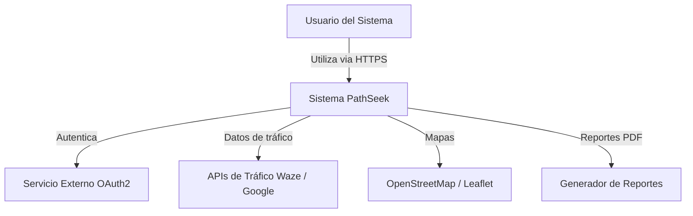
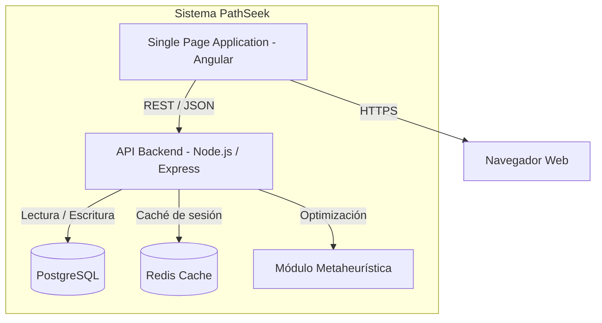
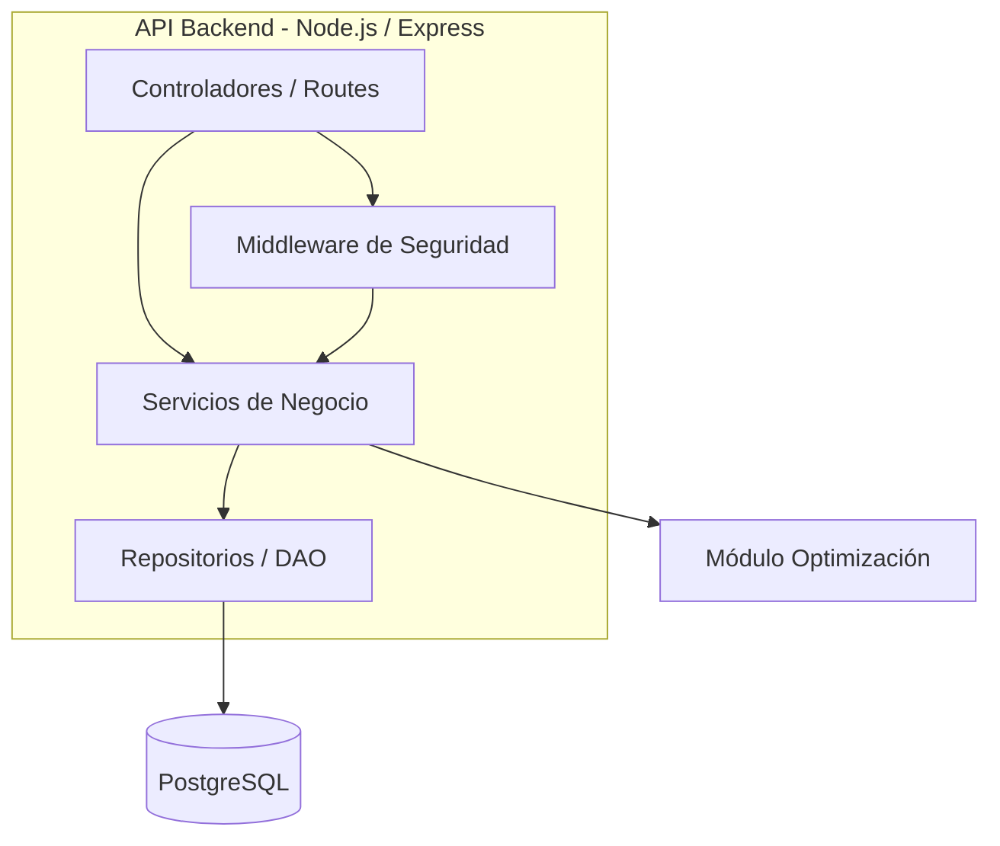
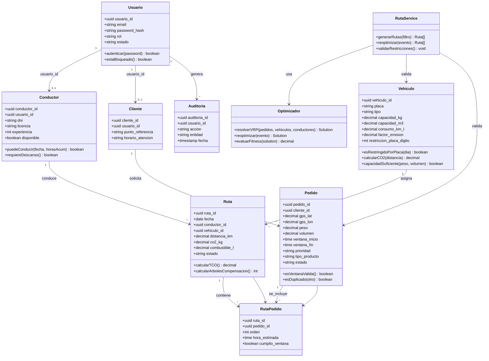
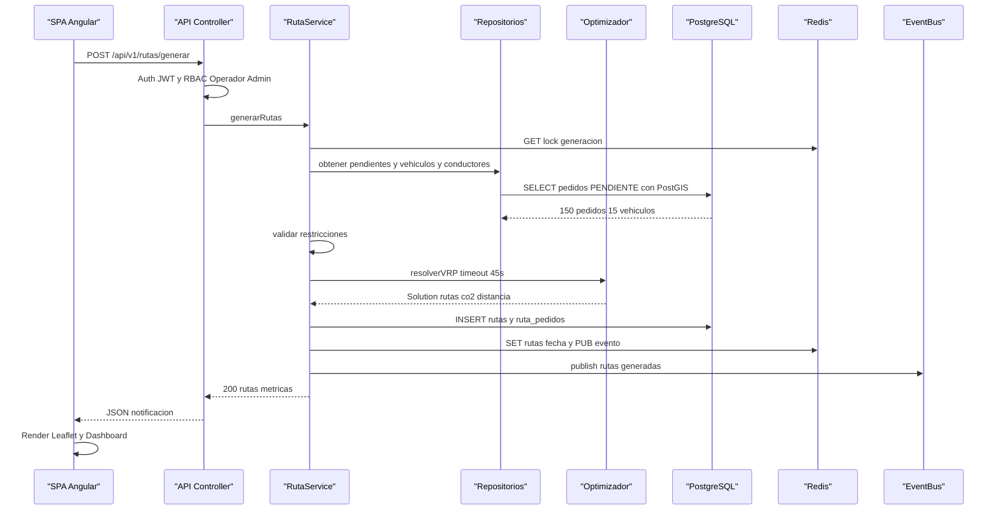
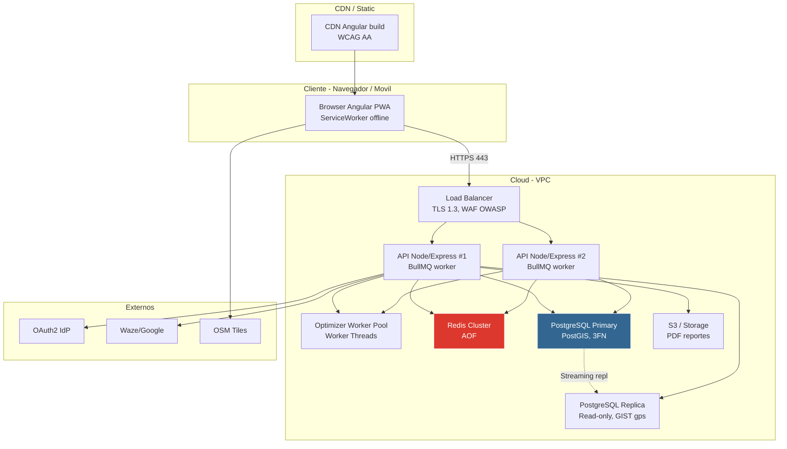
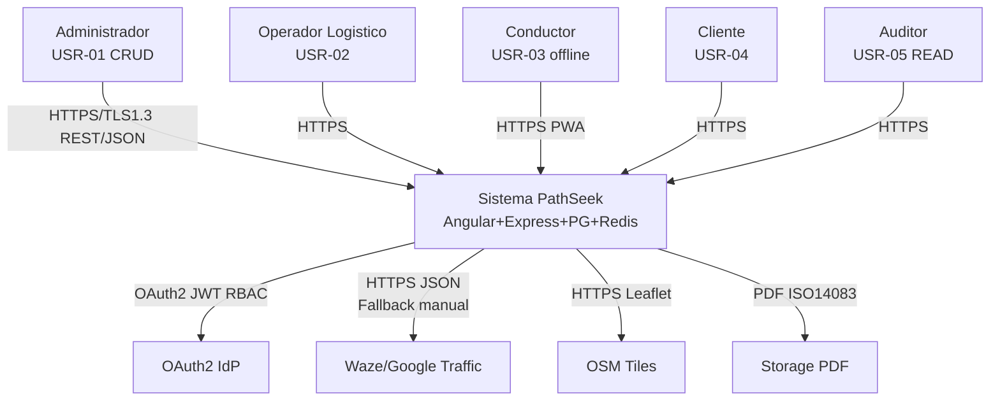

# Arquitectura de Software - Modelo C4

Proyecto: PathSeek
Código del documento: DOC-012
Versión: V_1_1_0
Fecha: 2026-09-01
Responsable: Equipo del proyecto

## 1. Nivel 1: Diagrama de Contexto

**Descripción:** El sistema PathSeek es utilizado por operadores, conductores, administradores y clientes mediante HTTPS. Se integra con servicios externos de autenticación (OAuth2), tráfico en tiempo real (Waze/Google), mapas (OpenStreetMap) y generación de reportes.

---

## 2. Nivel 2: Diagrama de Contenedores

**Descripción:**

| Contenedor            | Tecnología           | Responsabilidad                                         |
| --------------------- | -------------------- | ------------------------------------------------------- |
| SPA (Frontend)        | Angular              | Interfaz de usuario, mapa interactivo, dashboard        |
| API Backend           | Node.js + Express    | Lógica de negocio, gestión de flota/pedidos/conductores |
| Base de Datos         | PostgreSQL           | Persistencia relacional de entidades                    |
| Redis Cache           | Redis                | Caché de sesiones y consultas frecuentes                |
| Módulo Metaheurística | Node.js / TypeScript | Algoritmo de optimización de rutas (VRPTW/Green VRP)    |

---

## 3. Nivel 3: Diagrama de Componentes

**Descripción de componentes:**

| Componente              | Responsabilidad                                  |
| ----------------------- | ------------------------------------------------ |
| Controladores / Routes  | Exponer endpoints REST, validar peticiones       |
| Middleware de Seguridad | Autenticación JWT, autorización RBAC, logging    |
| Servicios de Negocio    | Aplicar reglas de negocio (RN-001 a RN-012)      |
| Repositorios / DAO      | Acceso a datos PostgreSQL, consultas optimizadas |
| Módulo Optimización     | Implementar metaheurística para rutas            |

---

## 4. Nivel 4: Diagrama de Código (L4) - Dominio Representativo

### 4.1 Diagrama de clases de dominio

### 4.2 Secuencia crítica: Generación de rutas

---

## 5. Nivel de Despliegue (C4 L0 - Complementario)

**SLOs:** Disponibilidad 99.5% 5AM-10PM Lun-Sab, RTO 30s failover LB+PG, RPO 5s WAL, Autoscaling CPU 70%.

---

## 6. Trazabilidad Transversal

| RF                  | Contenedor            | Componente L3               | Entidad DB          |
| ------------------- | --------------------- | --------------------------- | ------------------- |
| RF-001 Flota        | API, PG               | Services, Repos, Validation | vehiculos           |
| RF-002 Pedidos      | API, PG, Redis        | Validation, Services, Repos | pedidos, clientes   |
| RF-003 Rutas        | Optimizador, API, PG  | OptimizerAdapter, Services  | rutas, ruta_pedidos |
| RF-004 Mapa         | SPA, OSM              | SPA Leaflet                 | pedidos.gps, rutas  |
| RF-005 Dashboard    | SPA, API, PG          | Services, Cache             | rutas.co2/distancia |
| RF-006 Reportes     | API, Storage          | ReportGen                   | rutas, vehiculos    |
| RF-007 Re-opt       | EventBus, Optimizador | EventBus, OptimizerAdapter  | rutas (estado)      |
| RF-008 Conductores  | API, PG               | Services, Validation        | conductores         |
| RF-009 Clientes     | SPA, API, PG          | Services                    | clientes            |
| RF-010 Compensacion | API, ReportGen        | Services, ReportGen         | rutas.co2           |

---

## 7. Decisiones Arquitectónicas Clave (ADR)

| ID     | Decision                                      | Alternativa descartada       | Justificacion                                                                          |
| ------ | --------------------------------------------- | ---------------------------- | -------------------------------------------------------------------------------------- |
| ADR-01 | Backend unico Node/Express + TS (sin FastAPI) | MEAN+Mongo, Java Spring Boot | Lenguaje unificado JS/TS, async I/O, open source, costo infra S/500k, memoria JVM alta |
| ADR-02 | PostgreSQL+PostGIS 3FN                        | MongoDB                      | Integridad referencial, geo ST_Distance, escalamiento horizontal, TCO                  |
| ADR-03 | Optimizador aislado Worker Threads            | In-process monolitico        | SLA 45s/30s sin bloquear event loop, experimentacion metaheuristicas                   |
| ADR-04 | Redis Cache + BullMQ Pub/Sub                  | Sin cache / polling DB       | Sesiones JWT, rate-limit, cola re-opt debounce                                         |
| ADR-05 | Leaflet+OSM PWA offline-first                 | Google Maps pago             | Codigo abierto, costo, cache teselas, WCAG AA                                          |

---

## 8. Convenciones y Leyenda

- **Notación:** C4 con Mermaid `C4Context/C4Container/C4Component/classDiagram/sequenceDiagram`. Flechas `--> "protocolo"` = HTTPS/TLS1.3/REST JSON/TCP.
- **Colores:** Personas azul, Sistemas azul oscuro, Externos gris, DB rojo, Contenedor interno.
- **Versionado:** V_1_0_0 creación, V_1_1_0 mejora diagramas (este doc). Historial Git preserva V_1_0_0.

---

## 9. Apéndice A: Fallback graph TD (compatibilidad)

Si tu visor no renderiza `C4Context`, usar:

---

## 10. Control de versiones

| Versión | Fecha      | Descripción                                                                           | Responsable         |
| ------- | ---------- | ------------------------------------------------------------------------------------- | ------------------- |
| V_1_0_0 | 2026-08-25 | Creación inicial del modelo C4                                                        | Equipo del proyecto |
| V_1_1_0 | 2026-09-01 | Mejora diagramas: C4Context/Container/Component, secuencia, despliegue, ADR, fallback | Equipo del proyecto |

---

## 11. Referencia

**Fuente principal:** Consigna PathSeek – Optimizador Rutas Sostenibles UGEL Huancayo. **Docs trazados:** 06 RF-001..010, 07 RNF-001..009, 08 USR-01..05 RBAC, 09 RN-001..012, 10 Stack, 11 DB DDL 3FN, 13 RES-01..21. **Marcos:** C4 Model (Brown), arc42, ISO/IEC 25010, OWASP Top10, WCAG 2.1 AA, ISO 14083, Ley 29733, Ley 30224, DS 033-2012-MTC.
