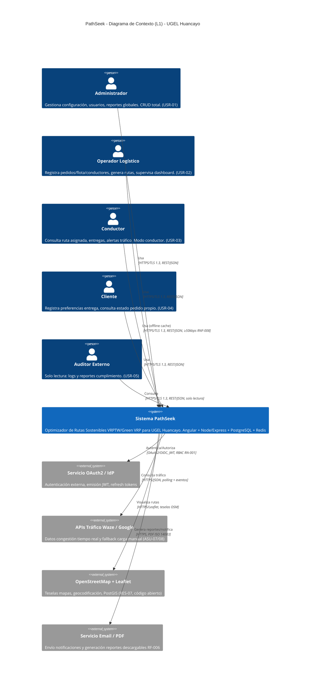
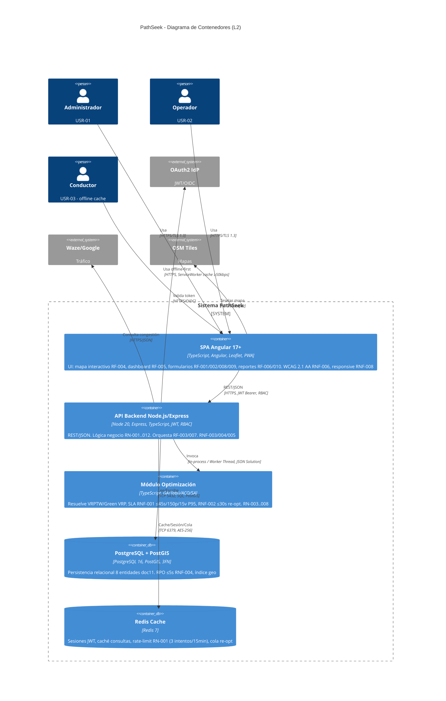
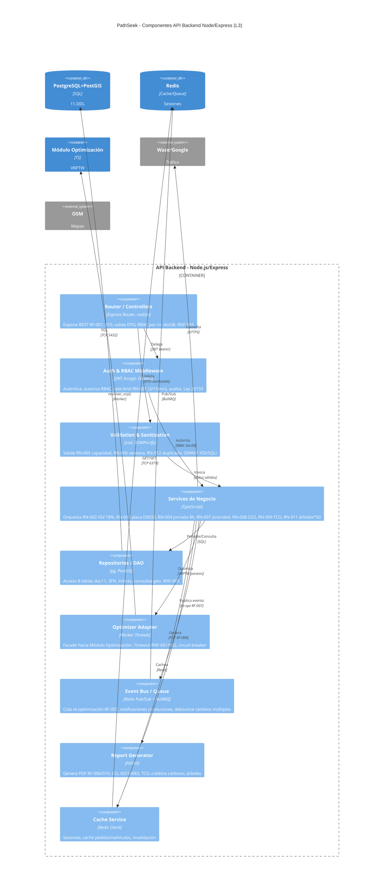
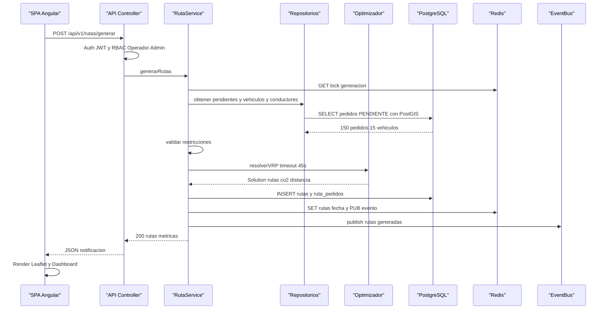
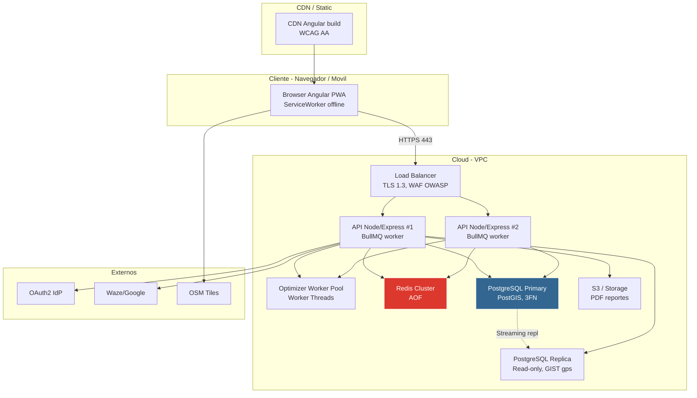
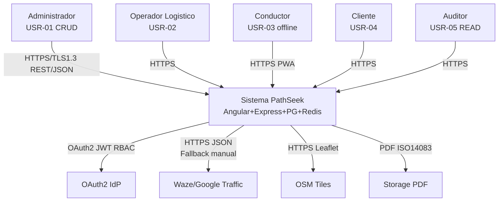

# Arquitectura de Software - Modelo C4

Proyecto: PathSeek
Código del documento: DOC-012
Versión: V_1_1_0
Fecha: 2026-09-01
Responsable: Equipo del proyecto

---

## 1. Nivel 1: Diagrama de Contexto (C4 L1)

### 1.1 Diagrama

> **Fallback `graph TD` si el renderer no soporta `C4Context`:** ver Apéndice A.

### 1.2 Actores vs RF

| Actor | RF principales | Descripción |
| ----- | -------------- | ----------- |
| Administrador (USR-01) | RF-001, RF-002, RF-008, RF-010 | CRUD total flota/pedidos/conductores/compensación, RNF-003/009 |
| Operador Logístico (USR-02) | RF-001..007 | Gestión operativa diaria, generación rutas RF-003, dashboard RF-005 |
| Conductor (USR-03) | RF-004, RF-007, RF-008 | Modo conductor RN-010, RNF-007/008 offline |
| Cliente (USR-04) | RF-002, RF-009 | Registro preferencias, READ pedido propio |
| Auditor (USR-05) | RF-006 | READ logs/reportes, Ley 29733 |

### 1.3 Sistemas externos y RNF asociados

| Sistema Externo | Protocolo | RNF | Mitigación |
| --------------- | --------- | --- | ---------- |
| OAuth2 / JWT | OAuth2/OIDC, JWT short-lived + refresh | RNF-003 Seguridad OWASP, Ley 29733 | AES-256 reposo, TLS 1.3 tránsito, bcrypt |
| Waze/Google Traffic | HTTPS/JSON | RNF-001/002 Rendimiento 45s/30s, RNF-005 1000 pedidos | Carga manual fallback, ponderación fuentes (ASU-08) |
| OSM/Leaflet/PostGIS | HTTPS/Leaflet, PostGIS geo | RNF-006 WCAG AA, RES-07 código abierto | Teselas cacheadas, responsive |
| Email/PDF | HTTPS | RNF-009 Documentación, ISO 14083 | PDF con huella CO₂ |

---

## 2. Nivel 2: Diagrama de Contenedores (C4 L2)

### 2.1 Diagrama

### 2.2 Catálogo de contenedores y trazabilidad

| Contenedor | Tecnología | RF cubiertos | RNF/RES clave | Escalabilidad |
| ---------- | ---------- | ------------ | ------------- | ------------- |
| SPA Angular | Angular 17, TS, Leaflet, PWA ServiceWorker | RF-004 Mapa, RF-005 Dashboard, RF-006 Reportes, RF-010 Compensación, RF-001/002/008 Forms | RNF-006 WCAG AA, RNF-007 usabilidad conductores, RNF-008 ≥50kbps offline, RNF-009 Swagger | CDN cache, lazy modules |
| API Backend | Node 20 + Express + TS | RF-001 Flota, RF-002 Pedidos, RF-003 Rutas, RF-007 Re-opt, RF-008 Conductores, RF-009 Clientes | RNF-003 OWASP 0% críticas, RNF-004 99.5% RTO30s, RNF-005 1000pd/50v | Async I/O, horizontal + LB |
| Módulo Optimización | TS GA/SA/ACO/Tabú aislado | RF-003, RF-007 | RNF-001 45s P95, RNF-002 30s, RN-003 placa, RN-004 jornada, RN-005 capacidad, RN-006 ventana, RN-007 prioridad, RN-008 CO₂ | Worker threads, warm start re-opt |
| PostgreSQL+PostGIS | PG 16 + PostGIS + 3FN | RF-001/002/008/009 (CRUD), RF-003 rutas | RNF-004 RPO5s, RES-07 open source, ISO 25010 | Réplica lectura, índices `idx_pedidos_estado`, `idx_rutas_fecha`, `GIST(gps)` |
| Redis | Redis 7 | Transversal: sesiones RN-001 | RNF-001/002 caché, RNF-004 disponibilidad | Cluster, persistencia AOF |
| Externos OSM/Waze/OAuth | OSM/Leaflet, Waze/Google, OAuth2 | RF-004 tráfico colores, Auth | RES-07 open source, Ley 29733 | Circuit breaker + fallback manual |

### 2.3 Flujos críticos

* **Generación rutas (RF-003):** `SPA -> API -> (Postgres pedidos+vehículos+conductores) -> Redis lock -> Optimizador (45s) -> Postgres rutas -> Redis pub -> SPA mapa+dashboard`
* **Re-optimización (RF-007):** `Evento (nuevo pedido/cancelación/accidente) -> Redis cola -> API -> Optimizador warm-start (30s) -> Notifica conductores (WebSocket/polling)`
* **Auth (RN-001/RNF-003):** `SPA -> API -> OAuth2/JWT -> Redis (intentos fallidos 3/15min) -> Postgres usuarios`

---

## 3. Nivel 3: Diagrama de Componentes (C4 L3) - API Backend

### 3.1 Diagrama

### 3.2 Responsabilidades y reglas

| Componente | Responsabilidad | RN/RF |
| ---------- | --------------- | ----- |
| Router/Controllers | REST endpoints, versionado `/api/v1`, OpenAPI/Swagger RNF-009 | RF-001..010 |
| Auth & RBAC | JWT short+refresh, bcrypt 12 rounds, RBAC matriz doc08, bloqueo RN-001 | RN-001, RNF-003 |
| Validation | zod schemas, sanitización OWASP, valida ventana `fin>inicio`, duplicado RN-012 | RN-005/006/012, RNF-003 |
| Services | Reglas negocio, orquesta transacciones, calcula IGV 18% RN-002, TCO RN-009, CO₂ RN-008 | RN-002..011 |
| Repositories | DAO 8 entidades, PostGIS `ST_Distance`, paginación RNF-005 | Doc11 DDL |
| Optimizer Adapter | Timeout 45s/30s, retry 1, fallback heurística greedy | RNF-001/002 |
| Event Bus | BullMQ cola re-opt, debounce 2s para cambios múltiples RF-007 | RF-007, RNF-002 |
| Report Generator | PDF ISO14083, créditos carbono, árboles = ton*50 RN-011 | RF-006/010, RN-011 |
| Cache Service | Cache-aside, TTL 5min pedidos, sesión 30min inactividad doc08 | RNF-001/004 |

---

## 4. Nivel 4: Diagrama de Código (L4) - Dominio Representativo

### 4.1 Diagrama de clases de dominio

### 4.2 Secuencia crítica: Generación de rutas

---

## 5. Nivel de Despliegue (C4 L0 - Complementario)

**SLOs:** Disponibilidad 99.5% 5AM-10PM Lun-Sab, RTO 30s failover LB+PG, RPO 5s WAL, Autoscaling CPU 70%.

---

## 6. Trazabilidad Transversal

| RF | Contenedor | Componente L3 | Entidad DB |
| -- | ---------- | ------------- | ---------- |
| RF-001 Flota | API, PG | Services, Repos, Validation | vehiculos |
| RF-002 Pedidos | API, PG, Redis | Validation, Services, Repos | pedidos, clientes |
| RF-003 Rutas | Optimizador, API, PG | OptimizerAdapter, Services | rutas, ruta_pedidos |
| RF-004 Mapa | SPA, OSM | SPA Leaflet | pedidos.gps, rutas |
| RF-005 Dashboard | SPA, API, PG | Services, Cache | rutas.co2/distancia |
| RF-006 Reportes | API, Storage | ReportGen | rutas, vehiculos |
| RF-007 Re-opt | EventBus, Optimizador | EventBus, OptimizerAdapter | rutas (estado) |
| RF-008 Conductores | API, PG | Services, Validation | conductores |
| RF-009 Clientes | SPA, API, PG | Services | clientes |
| RF-010 Compensacion | API, ReportGen | Services, ReportGen | rutas.co2 |

---

## 7. Decisiones Arquitectónicas Clave (ADR)

| ID | Decision | Alternativa descartada | Justificacion |
| -- | -------- | ---------------------- | ------------- |
| ADR-01 | Backend unico Node/Express + TS (sin FastAPI) | MEAN+Mongo, Java Spring Boot | Lenguaje unificado JS/TS, async I/O, open source, costo infra S/500k, memoria JVM alta |
| ADR-02 | PostgreSQL+PostGIS 3FN | MongoDB | Integridad referencial, geo ST_Distance, escalamiento horizontal, TCO |
| ADR-03 | Optimizador aislado Worker Threads | In-process monolitico | SLA 45s/30s sin bloquear event loop, experimentacion metaheuristicas |
| ADR-04 | Redis Cache + BullMQ Pub/Sub | Sin cache / polling DB | Sesiones JWT, rate-limit, cola re-opt debounce |
| ADR-05 | Leaflet+OSM PWA offline-first | Google Maps pago | Codigo abierto, costo, cache teselas, WCAG AA |

---

## 8. Convenciones y Leyenda

* **Notación:** C4 con Mermaid `C4Context/C4Container/C4Component/classDiagram/sequenceDiagram`. Flechas `--> "protocolo"` = HTTPS/TLS1.3/REST JSON/TCP.
* **Colores:** Personas azul, Sistemas azul oscuro, Externos gris, DB rojo, Contenedor interno.
* **Versionado:** V_1_0_0 creación, V_1_1_0 mejora diagramas (este doc). Historial Git preserva V_1_0_0.

---

## 9. Apéndice A: Fallback graph TD (compatibilidad)

Si tu visor no renderiza `C4Context`, usar:

---

## 10. Control de versiones

| Versión | Fecha | Descripción | Responsable |
| ------- | ---------- | ----------------------------------------- | ------------------- |
| V_1_0_0 | 2026-08-25 | Creación inicial del modelo C4 | Equipo del proyecto |
| V_1_1_0 | 2026-09-01 | Mejora diagramas: C4Context/Container/Component, secuencia, despliegue, ADR, fallback | Equipo del proyecto |

---

## 11. Referencia

**Fuente principal:** Consigna PathSeek – Optimizador Rutas Sostenibles UGEL Huancayo. **Docs trazados:** 06 RF-001..010, 07 RNF-001..009, 08 USR-01..05 RBAC, 09 RN-001..012, 10 Stack, 11 DB DDL 3FN, 13 RES-01..21. **Marcos:** C4 Model (Brown), arc42, ISO/IEC 25010, OWASP Top10, WCAG 2.1 AA, ISO 14083, Ley 29733, Ley 30224, DS 033-2012-MTC.
