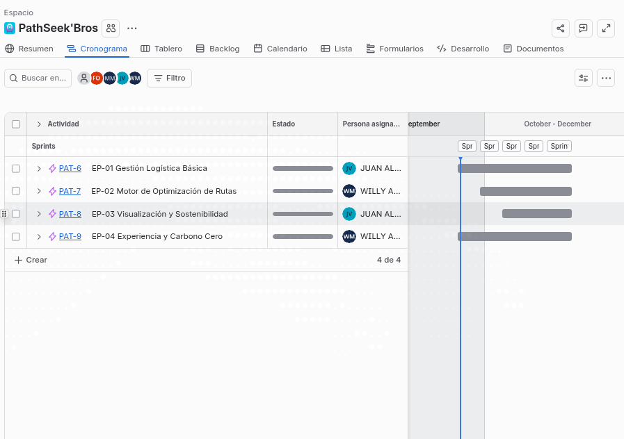
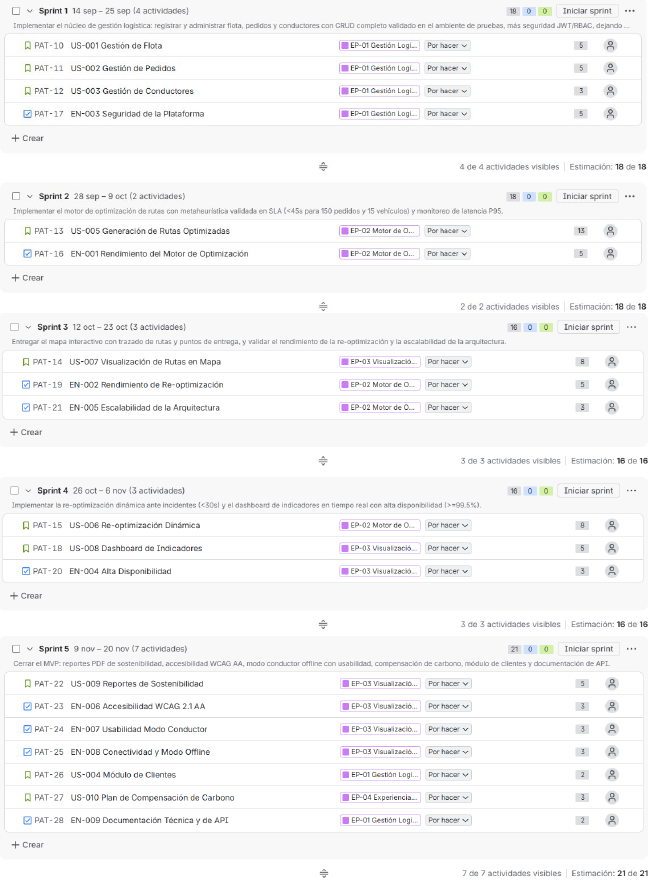
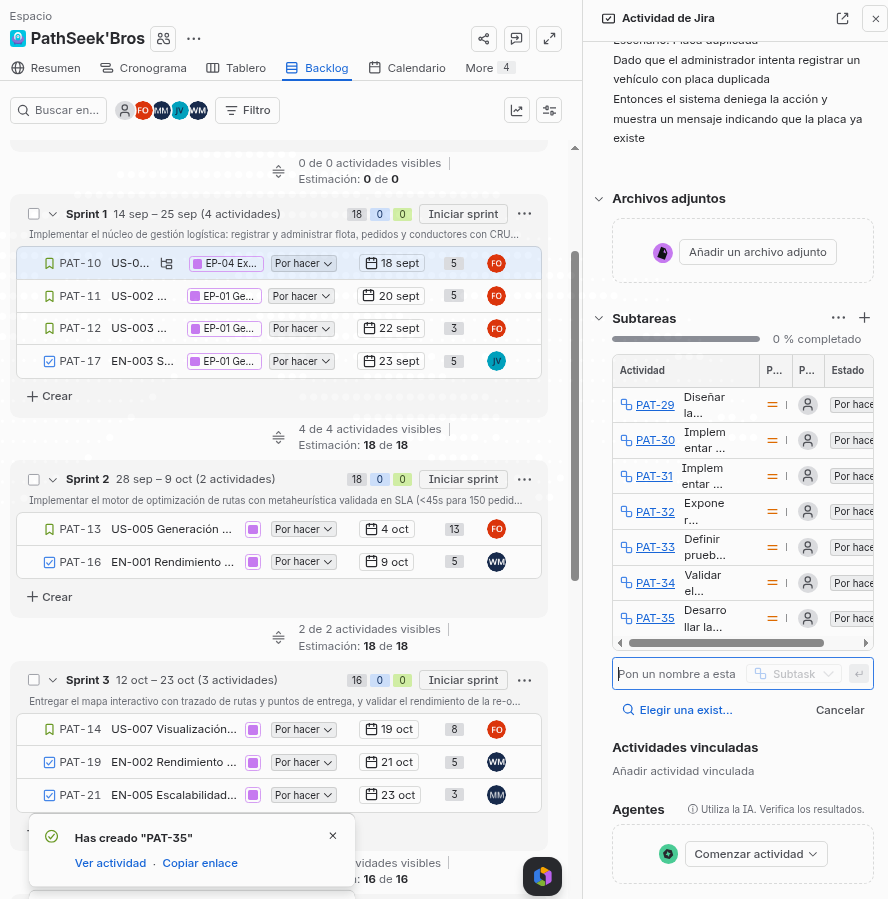
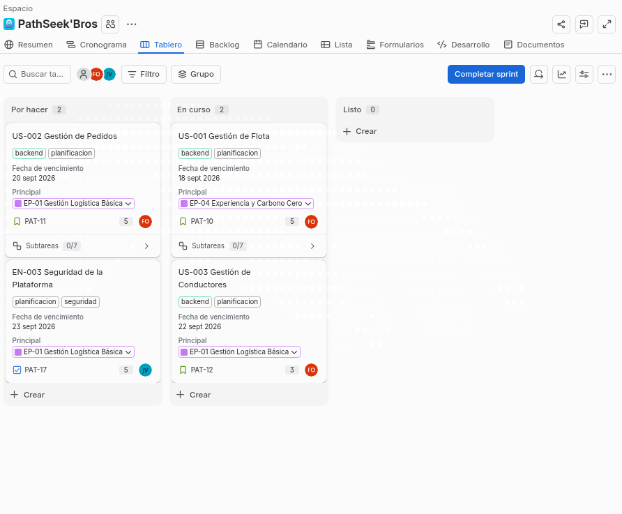
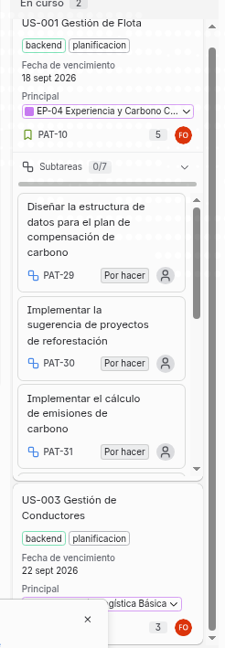

[← Volver al README Principal](../../README.md)

# Artefactos Jira Software: Informe de Configuración y Evidencias

Proyecto: PathSeek
Código del documento: DOC-015
Versión: V_1_1_0
Fecha: 2026-09-07

---

## 1. Configuración General del Proyecto en Jira

| Campo | Valor configurado |
| --- | --- |
| **Producto Atlassian** | Jira Software (Cloud) |
| **Nombre del proyecto** | PathSeek – Optimización de Rutas Sostenibles |
| **Clave del proyecto** | PATHSEEK |
| **Plantilla de proyecto** | Scrum (gestión de software) |
| **Administrador del proyecto** | Equipo PIPRE (Project Manager) |
| **Miembros del equipo** | Project Manager, Software Architect, 2 Developers Junior, QA Engineer, UI/UX Designer |
| **Versión oficial creada** | `v1.0.0-MVP` |
| **Sprint activo** | Sprint 1 (2 semanas, finalizado el 2026-09-25) |

---

## 2. Jerarquía del Trabajo (Issue Types)

Se configuraron los siguientes tipos de incidencia según la directriz de la consigna:

| Nivel | Tipo de incidencia | Uso en PathSeek | Ejemplo |
| --- | --- | --- | --- |
| 1 | **Épica (Epic)** | Módulos o grandes bloques funcionales del PFA | EP-01 Gestión Logística Básica |
| 2 | **Historia de Usuario (Story)** | Funcionalidades del usuario final | US-001 Gestión de Flota |
| 2 | **Historia Técnica (Task / Enabler)** | Tareas de arquitectura, DevOps o bases de datos | EN-003 Seguridad de la Plataforma |
| 3 | **Subtarea (Sub-task)** | Unidades mínimas de trabajo técnico (≤ 8 horas) | "Crear endpoint POST /vehiculos" |
| — | **Error (Bug)** | Incidencias detectadas durante o al final del Sprint | "El dashboard no actualiza emisiones en Safari" |

### 2.1 Asociación Épica ↔ Historias

| Épica | Historias / Tareas asociadas |
| --- | --- |
| EP-01 Gestión Logística Básica | US-001, US-002, US-003, US-004, EN-003, EN-009 |
| EP-02 Motor de Optimización de Rutas | US-005, US-006, EN-001, EN-002, EN-005 |
| EP-03 Visualización y Sostenibilidad | US-007, US-008, US-009, EN-004, EN-006, EN-007, EN-008 |
| EP-04 Experiencia y Carbono Cero | US-010 |

---

## 3. Gestión del Producto

### 3.1 Roadmap de Épicas

Las cuatro (4) épicas se alinearon en la línea de tiempo del Roadmap de Jira según las iteraciones definidas en el acta de constitución:

| Épica | Iteración | Ventana estimada |
| --- | --- | --- |
| EP-01 Gestión Logística Básica | Iteración 2 | Semanas 4–7 |
| EP-02 Motor de Optimización de Rutas | Iteraciones 2–4 | Semanas 4–11 |
| EP-03 Visualización y Sostenibilidad | Iteración 3 | Semanas 8–11 |
| EP-04 Experiencia y Carbono Cero | Iteración 3 | Semanas 10–11 |

### 3.2 Backlog Priorizado

El backlog se ordenó por valor de negocio y riesgo técnico; cada elemento cuenta con estimación en **Story Points (Fibonacci: 1, 2, 3, 5, 8, 13)** y componente asignado:

| Prioridad | Clave | Resumen | Épica | Story Points | Componente |
| :---: | --- | --- | --- | :---: | --- |
| 1 | PATHSEEK-1 | US-001 Gestión de Flota | EP-01 | 5 | Backend |
| 2 | PATHSEEK-2 | US-002 Gestión de Pedidos | EP-01 | 5 | Backend |
| 3 | PATHSEEK-3 | US-003 Gestión de Conductores | EP-01 | 3 | Backend |
| 4 | PATHSEEK-4 | US-005 Generación de Rutas Optimizadas | EP-02 | 13 | Algoritmo |
| 5 | PATHSEEK-5 | EN-001 Rendimiento del Motor | EP-02 | 5 | Algoritmo |
| 6 | PATHSEEK-6 | EN-003 Seguridad de la Plataforma | EP-01 | 5 | Seguridad |
| 7 | PATHSEEK-7 | US-007 Visualización en Mapa | EP-03 | 8 | Frontend |
| 8 | PATHSEEK-8 | US-006 Re-optimización Dinámica | EP-02 | 8 | Algoritmo |
| 9 | PATHSEEK-9 | EN-002 Rendimiento de Re-optimización | EP-02 | 5 | Algoritmo |
| 10 | PATHSEEK-10 | US-008 Dashboard de Indicadores | EP-03 | 5 | Frontend |
| 11 | PATHSEEK-11 | EN-004 Alta Disponibilidad | EP-03 | 3 | DevOps |
| 12 | PATHSEEK-12 | EN-005 Escalabilidad | EP-02 | 3 | Arquitectura |
| 13 | PATHSEEK-13 | US-009 Reportes de Sostenibilidad | EP-03 | 5 | Frontend |
| 14 | PATHSEEK-14 | EN-006 Accesibilidad WCAG 2.1 AA | EP-03 | 3 | Frontend |
| 15 | PATHSEEK-15 | EN-007 Usabilidad Modo Conductor | EP-03 | 3 | UX |
| 16 | PATHSEEK-16 | EN-008 Conectividad / Offline | EP-03 | 3 | Frontend |
| 17 | PATHSEEK-17 | US-004 Módulo de Clientes | EP-01 | 2 | Backend |
| 18 | PATHSEEK-18 | US-010 Compensación de Carbono | EP-04 | 3 | Backend |
| 19 | PATHSEEK-19 | EN-009 Documentación y API | EP-01 | 2 | Backend |

### 3.3 Versiones y Releases

| Campo | Valor |
| --- | --- |
| **Versión creada** | `v1.0.0-MVP` |
| **Estado** | No liberada (en planificación) |
| **Descripción** | Primera versión del Producto Mínimo Viable: núcleo logístico + motor de optimización + visualización básica |
| **Historias asociadas** | PATHSEEK-1 a PATHSEEK-11 (prioridades 1-11) |
| **Fecha objetivo** | Semana 14 (2026-11-28), alineada al hito H-05 del acta |

---

## 4. Ejecución del Sprint 1

### 4.1 Datos del Sprint

| Campo | Valor |
| --- | --- |
| **Sprint** | Sprint 1 |
| **Duración** | 2 semanas |
| **Inicio** | 2026-09-14 |
| **Fin** | 2026-09-25 |
| **Story Points comprometidos** | 18 |

### 4.2 Sprint Goal (Objetivo del Sprint)

> **"Implementar el núcleo de gestión logística: registrar y administrar flota, pedidos y conductores con CRUD completo validado en el ambiente de pruebas, dejando la base de datos maestra lista para alimentar el motor de optimización del Sprint 2."**

### 4.3 Ítems seleccionados para el Sprint 1

| Clave | Resumen | Tipo | Story Points | Responsable | Estado |
| --- | --- | --- | :---: | --- | :---: |
| PATHSEEK-1 | US-001 Gestión de Flota | Story | 5 | Developer Junior Backend | Done |
| PATHSEEK-2 | US-002 Gestión de Pedidos | Story | 5 | Developer Junior Backend | Done |
| PATHSEEK-3 | US-003 Gestión de Conductores | Story | 3 | Developer Junior Backend | Done |
| PATHSEEK-6 | EN-003 Seguridad de la Plataforma (JWT + RBAC) | Task | 5 | Software Architect + Backend | Done |
| — | Subtareas técnicas (CRUD, validaciones, migraciones) | Sub-task | ≤ 8 h c/u | Equipo de desarrollo | Done |

### 4.4 Tablero Scrum Activo

El flujo de trabajo del tablero se configuró con las siguientes columnas:

| Columna | Estado del flujo | Límite WIP | Descripción |
| --- | --- | :---: | --- |
| **To Do** | Pendiente | — | Ítems del backlog asignados al Sprint aún no iniciados. |
| **In Progress** | En curso | 3 | Ítem en desarrollo activo por el responsable. |
| **In Review / QA** | En revisión | 2 | Código en Pull Request; pruebas y revisión por pares. |
| **Done** | Finalizado | — | Cumple el DoD global y los criterios de aceptación. |

Flujo: `To Do` → `In Progress` → `In Review / QA` → `Done`.

### 4.5 Cierre del Sprint 1

| Resultado | Valor |
| --- | --- |
| **Story Points comprometidos** | 18 |
| **Story Points completados** | 18 (100 %) |
| **Ítems traspasados al Sprint 2** | Migración Flyway `V4`, endpoint de dashboard (RF-005) y pipeline CI/CD |
| **Pull Requests integrados** | #4 (`Feature/backend-sprint1`) y #5 (`feature/database`) |

### 4.6 Cierre del Sprint 2

| Resultado | Valor |
| --- | --- |
| **Sprint** | Sprint 2 (2026-09-28 a 2026-10-09) |
| **Story Points comprometidos** | 26 |
| **Story Points completados** | 26 (100 %) |
| **Ítems completados en Sprint 2** | PATHSEEK-10 (US-008), PATHSEEK-7 (US-007), PATHSEEK-4 (US-005), PATHSEEK-15/16 (EN-007/008) y PATHSEEK-11 (EN-004) |
| **Story Points acumulados totales** | 44 / 89 SP (49.4 % del backlog general) |
| **Pull Requests integrados** | #6 y #7 (`fix-app-mobile` / mejoras web y móvil) |
| **Entorno de producción** | Servidor VPS Contabo `https://169.58.74.99` (HTTPS SSL / Docker Compose) |

El detalle del cierre de la iteración consta en los documentos de `docs/03 Implementación/` (Informe de estado, Registro de impedimentos, Revisión del Sprint y Retrospectiva).

---

## 5. Evidencias Fotográficas Requeridas

> **POLÍTICA ESTRICTA SOBRE CAPTURAS DE PANTALLA:**
> Queda **estrictamente prohibido** adjuntar capturas de pantalla completa (escritorio, barras de tareas del SO, pestañas del navegador o espacio sobrante). **Toda evidencia debe recortarse de forma exclusiva al contenedor/panel del elemento de Jira a demostrar.** Las capturas que incumplan esta norma restarán el 50 % del puntaje asignado a la sección.

| Evidencia | Archivo destino en `imagenes/` | Qué debe mostrar |
| --- | --- | --- |
| 1 | `evidencia1_roadmap.png` | Roadmap del proyecto con las 4 épicas en la línea de tiempo |
| 2 | `evidencia2_backlog.png` | Backlog priorizado con Story Points y componentes |
| 3 | `evidencia3_sprint_planning.png` | Planificación del Sprint 1 con los ítems seleccionados y el Sprint Goal en la cabecera |
| 4 | `evidencia4_tablero_scrum.png` | Tablero Scrum activo con tarjetas en To Do / In Progress / In Review / Done |
| 5 | `evidencia5_releases.png` | Módulo de Releases con la versión `v1.0.0-MVP` y sus historias asociadas |

### Evidencia 1: Roadmap del Proyecto

**Qué demuestra:** Mapeo de Épicas (EP-01 a EP-04) en la línea de tiempo del proyecto.

> *Pendiente: adjuntar captura recortada exclusivamente al panel del Roadmap de Jira.*

### Evidencia 2: Backlog Priorizado

**Qué demuestra:** Vista general del backlog con Story Points estimados (Fibonacci) y componentes asignados.

> *Pendiente: adjuntar captura recortada exclusivamente al panel del Backlog de Jira.*

### Evidencia 3: Sprint Planning & Sprint Goal

**Qué demuestra:** Detalle de los ítems seleccionados para el Sprint 1 y la meta redactada en la cabecera del sprint.

> *Pendiente: adjuntar captura recortada exclusivamente al panel del Sprint activo de Jira.*

### Evidencia 4: Tablero Scrum Activo

**Qué demuestra:** Flujo de trabajo con tarjetas distribuidas en las columnas `To Do`, `In Progress`, `In Review / QA` y `Done`.

> *Pendiente: adjuntar captura recortada exclusivamente al tablero Scrum de Jira.*

### Evidencia 5: Gestión de Versiones / Release

**Qué demuestra:** Vista del módulo de Releases mostrando la versión `v1.0.0-MVP` creada y su asociación de historias.

> *Pendiente: adjuntar captura recortada exclusivamente al panel de Releases de Jira.*

---

## 6. Historial de Control de Cambios

| Versión | Fecha | Descripción | Responsable |
| --- | --- | --- | --- |
| V_1_0_0 | 2026-09-07 | Creación inicial: informe de parametrización de Jira Software y plantilla de evidencias (Fase 02: Planificación). | Equipo PIPRE |
| V_1_1_0 | 2026-09-29 | Sincronización con el cierre del Sprint 1: ítems PATHSEEK-1/2/3/6 marcados como Done, resultado de 18/18 SP y sección de cierre del sprint. | Equipo PIPRE |
| V_1_2_0 | 2026-10-06 | Sincronización con el cierre del Sprint 2: ítems PATHSEEK-10/7/4/15/16/11 marcados como Done, resultado de 26/26 SP (44 SP acumulados) y despliegue en producción. | Equipo PIPRE |

---

## 7. Referencia

- **Consigna Fase 02:** `docs/a.html` — Consigna: Planificación del Proyecto (sección 2.2 y 2.3).
- **Documentos de Fase 01:** DOC-014 (Transformando a ágil), DOC-002 (Acta de Constitución).
- **Marco de referencia:** Guía oficial de Atlassian para Jira Software Cloud (Scrum), CMMI-DEV, PMBOK 7.ª Edición.
